## 2 ภาพรวมของ CRR

### 2.1 วิธีการของ CRR

CRR เป็นวิธีการประเมินแบบเบา (lightweight assessment method) ที่พัฒนาโดยกระทรวงความมั่นคงแห่งมาตุภูมิของสหรัฐฯ (DHS) โดยมีจุดประสงค์เพื่อประเมินแนวปฏิบัติด้านความมั่นคงปลอดภัยทางไซเบอร์ และความต่อเนื่องของการให้บริการ สำหรับเจ้าของและผู้ดำเนินงานโครงสร้างพื้นฐานที่สำคัญ

CRR ประกอบด้วยคำถามทั้งหมด 299 ข้อ ซึ่งโดยทั่วไปจะดำเนินการผ่านเวิร์กช็อปที่ใช้เวลาประมาณ 6 ชั่วโมง โดยมีผู้ประสานงานจาก DHS เป็นผู้นำเวิร์กช็อป ผู้ประสานงานจะซักถามข้อมูลจากบุคลากรขององค์กรที่ดูแลโครงสร้างพื้นฐานที่สำคัญในด้าน:

- ความมั่นคงปลอดภัยทางไซเบอร์
- การดำเนินงาน
- ความมั่นคงทางกายภาพ
- ความต่อเนื่องทางธุรกิจ

CRR Self-Assessment Package เป็นชุดเครื่องมือที่ช่วยให้องค์กรสามารถนำวิธีการเดียวกันนี้มาใช้ได้โดยไม่ต้องอาศัยผู้ประสานงานจากภายนอก ซึ่งในชุดนี้จะมี:

- คำถามชุดเดียวกัน
- กลไกการให้คะแนนแบบเดียวกัน
- ตัวเลือกในการพัฒนาปรับปรุงที่เหมือนกับการประเมินแบบมีผู้ประสานงานจาก DHS

### 2.2 สถาปัตยกรรมของ CRR

CRR เป็นการประเมินในรูปแบบสัมภาษณ์ที่มุ่งเน้นไปที่โปรแกรมการจัดการความมั่นคงปลอดภัยทางไซเบอร์ขององค์กร โดยมีเป้าหมายเพื่อทำความเข้าใจการบริหารจัดการด้านไซเบอร์ของบริการและสินทรัพย์ที่เกี่ยวข้องซึ่งมีความสำคัญต่อความสำเร็จของพันธกิจองค์กร

CRR มุ่งเน้นไปที่แนวปฏิบัติด้านการปกป้องและการคงอยู่ของระบบในพื้นที่หลักต่าง ๆ ที่มีบทบาทสำคัญต่อความสามารถในการฟื้นตัวทางไซเบอร์โดยรวมขององค์กร การประเมินจะวัดขีดความสามารถและพฤติกรรมสำคัญด้านความมั่นคงปลอดภัยทางไซเบอร์ เพื่อใช้เป็นตัวบ่งชี้เชิงความหมายของความยืดหยุ่นในการดำเนินงาน ทั้งในช่วงเวลาปกติและในช่วงที่องค์กรเผชิญกับความเครียดในการดำเนินงาน

CRR มีพื้นฐานมาจาก **CERT® Resilience Management Model (CERT®-RMM)** ซึ่งพัฒนาโดยแผนก CERT ของ **Software Engineering Institute มหาวิทยาลัย Carnegie Mellon**

CERT-RMM เป็นโมเดลวุฒิภาวะที่มุ่งเน้นความสามารถ (capability-focused maturity model) สำหรับการปรับปรุงกระบวนการ ซึ่งสะท้อนแนวปฏิบัติที่ดีที่สุดจากทั้งภาคอุตสาหกรรมและภาครัฐ ในการจัดการความสามารถในการดำเนินงานอย่างยืดหยุ่นในสาขาต่าง ๆ ได้แก่:

- การจัดการความมั่นคงปลอดภัย (Security Management)
- การจัดการความต่อเนื่องทางธุรกิจ (Business Continuity Management)
- การจัดการการปฏิบัติงานด้านเทคโนโลยีสารสนเทศ (IT Operations Management)

ตารางที่ 1 แสดงองค์ประกอบของแต่ละโดเมนใน CRR โดยแต่ละโดเมนประกอบด้วย:

- คำชี้แจงวัตถุประสงค์ (Purpose Statement)
- ชุดของเป้าหมายเฉพาะและคำถามแนวปฏิบัติที่เฉพาะเจาะจงต่อแต่ละโดเมน
- ชุดคำถาม MIL (Maturity Indicator Level) มาตรฐาน ซึ่งใช้ตรวจสอบระดับการฝังตัวของแนวปฏิบัติภายในองค์กร

#### ตารางที่ 1: องค์ประกอบโดเมนของ CRR

| **โดเมน CRR**                                                      | **จำนวนเป้าหมาย** | **จำนวนแนวปฏิบัติของเป้าหมาย** | **จำนวนแนวปฏิบัติ MIL**\* |
| ------------------------------------------------------------------ | ----------------- | ------------------------------ | ------------------------- |
| การจัดการสินทรัพย์ (Asset Management)                              | 7                 | 30                             | 13                        |
| การควบคุมมาตรการ (Controls Management)                             | 4                 | 16                             | 13                        |
| การกำหนดค่าและการเปลี่ยนแปลง (Configuration and Change Management) | 3                 | 23                             | 13                        |
| การจัดการช่องโหว่ (Vulnerability Management)                       | 4                 | 15                             | 13                        |
| การจัดการเหตุการณ์ (Incident Management)                           | 5                 | 23                             | 13                        |
| การจัดการความต่อเนื่องของบริการ (Service Continuity Management)    | 4                 | 16                             | 13                        |
| การจัดการความเสี่ยง (Risk Management)                              | 5                 | 13                             | 13                        |
| การจัดการการพึ่งพาภายนอก (External Dependencies Management)        | 5                 | 14                             | 13                        |
| การฝึกอบรมและความตระหนักรู้ (Training and Awareness)               | 2                 | 11                             | 13                        |
| การรับรู้สถานการณ์ (Situational Awareness)                         | 3                 | 8                              | 13                        |

- MIL = Maturity Indicator Level (ระดับตัวบ่งชี้วุฒิภาวะ)

แม้จำนวนเป้าหมายและคำถามแนวปฏิบัติจะต่างกันในแต่ละโดเมน แต่คำถาม MIL และแนวคิดที่ใช้วัดนั้น **เหมือนกันทุกโดเมน** คำถามใน CRR ทุกข้อจะมีตัวเลือกคำตอบ 3 แบบ ได้แก่: **"Yes" (ใช่), "No" (ไม่ใช่), และ "Incomplete" (ยังไม่สมบูรณ์)**

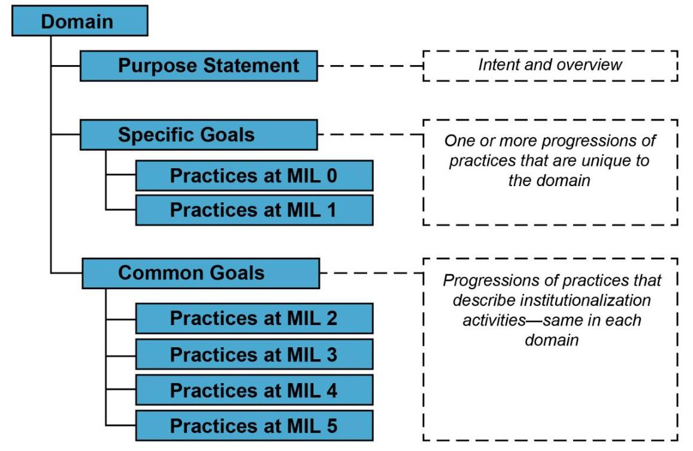

## 2.3 รายละเอียดของโดเมน (Domain Descriptions)

ในส่วนนี้เป็นการอธิบายรายละเอียดของทั้ง 10 โดเมนของ CRR และสรุปเป้าหมายและแนวปฏิบัติของแต่ละโดเมน

### การบริหารจัดการสินทรัพย์ (Asset Management - AM)

**วัตถุประสงค์:** เพื่อระบุ บันทึก และจัดการสินทรัพย์ตลอดช่วงวงจรชีวิตของสินทรัพย์เพื่อให้เกิดประสิทธิภาพต่อเนื่องในการสนับสนุนบริการที่สำคัญ

โดเมน Asset Management ช่วยให้องค์กรสามารถวางแผน ระบุ บันทึก และจัดการสินทรัพย์ที่จำเป็นต่อการดำเนินงานของบริการต่าง ๆ ได้อย่างเป็นระบบ โดยจัดหมวดหมู่สินทรัพย์ออกเป็น 4 กลุ่ม ได้แก่:

- **บุคลากร (People):** ผู้ที่ใช้ในการดำเนินงานและควบคุมบริการ
- **ข้อมูล (Information):** ข้อมูลที่ใช้ในกระบวนการและข้อมูลผลลัพธ์จากบริการ
- **เทคโนโลยี (Technology):** ระบบอัตโนมัติและเครื่องมือที่ใช้สนับสนุนบริการ
- **สถานที่ (Facilities):** สถานที่ในการปฏิบัติงานหรือดำเนินบริการ

โดเมน Asset Management ประกอบด้วย **7 เป้าหมายหลัก และ 30 แนวปฏิบัติ** โดยสามารถแบ่งเบื้องต้นได้ดังนี้:

**เป้าหมายที่ 1: มีการระบุและจัดลำดับความสำคัญของบริการ (Services are identified and prioritized)**

1. มีการระบุบริการขององค์กร
2. มีการจัดลำดับความสำคัญของบริการตามผลกระทบหากบริการหยุดชะงัก
3. มีการระบุและสื่อสารพันธกิจ วิสัยทัศน์ ค่านิยม และบทบาทขององค์กรในโครงสร้างพื้นฐานที่สำคัญ
4. มีการจัดลำดับความสำคัญของพันธกิจ วัตถุประสงค์ และกิจกรรมขององค์กร

**เป้าหมายที่ 2: มีการจัดทำรายการสินทรัพย์ และกำหนดอำนาจและความรับผิดชอบ (Assets are inventoried, and the authority and responsibility for these assets is established)**

1. มีการทำบัญชีสินทรัพย์ที่สนับสนุนบริการสำคัญ (รวมถึงฮาร์ดแวร์ ซอฟต์แวร์ และระบบภายนอก)
2. รายละเอียดของสินทรัพย์รวมถึงข้อกำหนดด้านการป้องกันและความต่อเนื่อง
3. มีการระบุเจ้าของและผู้ดูแลสินทรัพย์ในบัญชีสินทรัพย์
4. มีการระบุสถานที่ตั้งของสินทรัพย์ทั้งภายในและภายนอกองค์กร
5. มีการทำแผนผังและเอกสารเกี่ยวกับการสื่อสารและการไหลของข้อมูลในองค์กร

**เป้าหมายที่ 3: ความสัมพันธ์ระหว่างสินทรัพย์กับบริการได้รับการกำหนด (The relationship between assets and the services they support is established)**

1. มีการบันทึกความเชื่อมโยงระหว่างสินทรัพย์กับบริการสำคัญที่สินทรัพย์นั้นสนับสนุน
2. มีการกำหนดข้อกำหนดด้านความลับ ความถูกต้อง และความพร้อมใช้งานสำหรับสินทรัพย์ที่เกี่ยวข้องกับบริการ

**เป้าหมายที่ 4: มีการจัดการบัญชีรายการสินทรัพย์อย่างเหมาะสม**

1. มีการกำหนดเกณฑ์การเปลี่ยนแปลงคำอธิบายของสินทรัพย์
2. คำอธิบายสินทรัพย์จะได้รับการอัปเดตเมื่อเกิดการเปลี่ยนแปลงต่อสินทรัพย์นั้น ๆ

**เป้าหมายที่ 5: มีการควบคุมการเข้าถึงสินทรัพย์อย่างเหมาะสม**

1. การอนุญาตเข้าถึงสินทรัพย์ (รวมถึงตัวตนและข้อมูลรับรอง) จะพิจารณาตามข้อกำหนดการปกป้องสินทรัพย์นั้น
2. คำขอการเข้าถึงจะต้องได้รับการตรวจสอบและอนุมัติโดยเจ้าของสินทรัพย์
3. มีการทบทวนสิทธิ์การเข้าถึงเพื่อระบุสิทธิ์ที่มากเกินความจำเป็นหรือไม่เหมาะสม
4. สิทธิ์การเข้าถึงจะถูกปรับแก้ตามผลการทบทวน
5. การกำหนดสิทธิ์การเข้าถึงต้องคำนึงถึงหลัก "สิทธิ์เท่าที่จำเป็น" (Least Privilege)
6. การจัดการสิทธิ์ต้องรวมหลัก "แยกหน้าที่กัน" (Separation of Duties)
7. ตัวตน (เช่น บัญชีผู้ใช้) จะต้องได้รับการยืนยันก่อนที่จะผูกกับข้อมูลรับรอง (credentials) ที่ใช้ในการใช้งาน

**เป้าหมายที่ 6: มีการจัดประเภทและบริหารจัดการข้อมูลเพื่อคงไว้ซึ่งการให้บริการสำคัญ**

1. ข้อมูลจะถูกจัดประเภทตามความอ่อนไหวและผลกระทบที่มีต่อบริการสำคัญ (เช่น สาธารณะ ใช้ภายในเท่านั้น ลับ)
2. การจัดประเภทข้อมูลจะต้องถูกติดตามและบังคับใช้อย่างต่อเนื่อง
3. มีการจัดทำนโยบายและระเบียบปฏิบัติในการติดป้ายและจัดการข้อมูลอย่างเหมาะสม
4. บุคลากรทุกคนที่จัดการข้อมูล (รวมถึงผู้รับเหมา) ต้องได้รับการฝึกอบรมในการใช้งานข้อมูลตามประเภทที่กำหนด
5. ข้อมูลที่มีมูลค่าสูงต้องมีการสำรองข้อมูลและเก็บรักษาไว้อย่างเหมาะสม
6. มีแนวทางในการทำลายข้อมูลอย่างเหมาะสมเมื่อไม่ใช้งาน
7. การปฏิบัติตามแนวทางการทำลายข้อมูลจะต้องถูกตรวจสอบและบังคับใช้อย่างต่อเนื่อง

**เป้าหมายที่ 7: มีการจัดลำดับความสำคัญและบริหารจัดการสถานที่ที่สนับสนุนบริการสำคัญ**

1. สถานที่จะได้รับการจัดลำดับความสำคัญตามผลกระทบต่อบริการ เพื่อระบุว่าควรมุ่งเน้นการปกป้องและสนับสนุนสถานที่ใด
2. การจัดลำดับความสำคัญของสถานที่จะต้องได้รับการทบทวนและยืนยันความถูกต้อง
3. ข้อกำหนดด้านการปกป้องและการคงอยู่ของบริการจะต้องถูกรวมอยู่ในการพิจารณาคัดเลือกสถานที่

### การควบคุมมาตรการ (Controls Management - CM)

**วัตถุประสงค์:**
เพื่อระบุ วิเคราะห์ และบริหารจัดการมาตรการควบคุมในสภาพแวดล้อมการดำเนินงานของบริการที่สำคัญ

การควบคุมภายในเป็นกระบวนการกำกับดูแลที่องค์กรใช้เพื่อให้มั่นใจว่าสามารถดำเนินการตามวัตถุประสงค์ได้อย่างมีประสิทธิภาพและมีประสิทธิผล พร้อมทั้งให้ความมั่นใจอย่างสมเหตุสมผลว่าการดำเนินงานจะประสบความสำเร็จ

โดเมน **Controls Management** ใน CRR ให้แนวทางแก่องค์กรในการ:

- ระบุวัตถุประสงค์ของการควบคุม (control objectives)
- กำหนดมาตรการควบคุมให้สอดคล้องกับวัตถุประสงค์นั้น
- วิเคราะห์และประเมินประสิทธิผลของมาตรการควบคุมเพื่อการพัฒนาอย่างต่อเนื่อง

---

### โดเมนนี้ประกอบด้วย **4 เป้าหมาย** และ **16 แนวปฏิบัติ**

**เป้าหมายที่ 1: มีการกำหนดวัตถุประสงค์ของการควบคุม**

1. มีการกำหนดวัตถุประสงค์ของการควบคุมสำหรับสินทรัพย์ที่จำเป็นต่อการให้บริการสำคัญ
2. มีการจัดลำดับความสำคัญของวัตถุประสงค์ของการควบคุมตามผลกระทบที่อาจเกิดขึ้นต่อบริการสำคัญ

**เป้าหมายที่ 2: มีการนำมาตรการควบคุมไปใช้จริง**

1. มีการดำเนินการควบคุมเพื่อให้บรรลุวัตถุประสงค์ของการควบคุมที่กำหนดไว้สำหรับบริการสำคัญ
2. มีการใช้มาตรการควบคุม เช่น การแยกเครือข่าย (network segregation) เพื่อรักษาความสมบูรณ์ของเครือข่าย
3. มีการควบคุมเพื่อปกป้องข้อมูลขณะเก็บรักษา (data at rest)
4. มีการควบคุมเพื่อปกป้องข้อมูลระหว่างส่งผ่าน (data in transit)
5. มีการควบคุมเพื่อป้องกันการรั่วไหลของข้อมูล (data leaks)
6. มีการกำหนด บันทึก ดำเนินการ และตรวจสอบบันทึกการตรวจสอบ/ล็อก (audit/log records) ตามนโยบาย
7. มีการควบคุมและจำกัดการใช้งานสื่อแบบถอดได้ (removable media) ตามนโยบาย
8. มีการควบคุมเพื่อปกป้องเครือข่ายการสื่อสารและเครือข่ายควบคุม (communication and control networks)
9. มีการนำแนวปฏิบัติด้านทรัพยากรบุคคลด้านไซเบอร์มาใช้กับบริการสำคัญ เช่น การยุติบัญชีผู้ใช้ การตรวจสอบประวัติบุคลากร
10. มีการควบคุมการเข้าถึงระบบและสินทรัพย์โดยอิงหลัก "การจำกัดฟังก์ชันการใช้งานเท่าที่จำเป็น" (least functionality) เช่น การระบุรายการอนุญาต (whitelisting) หรือรายการห้าม (blacklisting)

**เป้าหมายที่ 3: มีการวิเคราะห์การออกแบบการควบคุมเพื่อให้มั่นใจว่าสอดคล้องกับวัตถุประสงค์ของการควบคุม**

1. มีการวิเคราะห์การออกแบบการควบคุมเพื่อตรวจหาช่องว่างที่อาจไม่สามารถตอบสนองวัตถุประสงค์ได้อย่างเพียงพอ
2. จากผลการวิเคราะห์ อาจมีการเพิ่มมาตรการควบคุมใหม่ หรือปรับปรุงมาตรการเดิมให้เหมาะสม

**เป้าหมายที่ 4: มีการประเมินระบบควบคุมภายในเพื่อให้แน่ใจว่าวัตถุประสงค์ของการควบคุมบรรลุผล**

1. มีการประเมินประสิทธิภาพของการควบคุมตามรอบเวลา เพื่อยืนยันว่ายังคงสอดคล้องกับวัตถุประสงค์
2. จากผลการประเมิน อาจมีการเพิ่มมาตรการควบคุมใหม่ หรือปรับปรุงมาตรการที่มีอยู่เพื่อแก้ไขจุดบกพร่อง

### การจัดการการกำหนดค่าและการเปลี่ยนแปลง (Configuration and Change Management - CCM)

**วัตถุประสงค์:**
เพื่อจัดตั้งกระบวนการที่รับรองความสมบูรณ์ของสินทรัพย์ โดยใช้การควบคุมการเปลี่ยนแปลงและการตรวจสอบการเปลี่ยนแปลง

โครงสร้างพื้นฐานของสินทรัพย์ในองค์กรมีการเปลี่ยนแปลงอยู่ตลอดเวลา ตามเทคโนโลยี ข้อมูล และบุคลากรที่เปลี่ยนแปลงไป โดเมน **Configuration and Change Management** จึงมุ่งเน้นไปที่วิธีการที่องค์กรสามารถนำกระบวนการและขั้นตอนมาใช้ในการบริหารสินทรัพย์ และทำให้การเปลี่ยนแปลงที่เกิดขึ้นกับสินทรัพย์ส่งผลกระทบต่อองค์กรน้อยที่สุด

โดเมนนี้ประกอบด้วย **3 เป้าหมาย** และ **23 แนวปฏิบัติ** ได้แก่:

---

**เป้าหมายที่ 1: มีการจัดการวงจรชีวิตของสินทรัพย์**

1. มีการใช้กระบวนการจัดการการเปลี่ยนแปลง (Change Management) เพื่อบริหารการปรับเปลี่ยนสินทรัพย์
2. มีการประเมินข้อกำหนดด้านความยืดหยุ่นอันเนื่องมาจากการเปลี่ยนแปลงของสินทรัพย์
3. มีการวางแผนและบริหารความสามารถ (Capacity) ของสินทรัพย์
4. คำร้องขอเปลี่ยนแปลงจะถูกติดตามจนกว่าจะแล้วเสร็จ
5. ผู้มีส่วนได้ส่วนเสียจะได้รับแจ้งเมื่อได้รับผลกระทบจากการเปลี่ยนแปลงของสินทรัพย์
6. มีการใช้วงจรชีวิตของการพัฒนาระบบ (System Development Life Cycle) เพื่อบริหารระบบที่สนับสนุนบริการสำคัญ

**เป้าหมายที่ 2: มีการบริหารความสมบูรณ์ของเทคโนโลยีและข้อมูล**

1. มีการดำเนินการจัดการกำหนดค่าสำหรับสินทรัพย์ด้านเทคโนโลยี
2. ใช้เทคนิคในการตรวจจับการเปลี่ยนแปลงของสินทรัพย์ด้านเทคโนโลยี
3. การปรับเปลี่ยนสินทรัพย์ด้านเทคโนโลยีต้องได้รับการตรวจสอบ
4. ข้อกำหนดด้านความสมบูรณ์ถูกใช้ในการกำหนดว่าใครมีสิทธิ์ในการปรับเปลี่ยนข้อมูล
5. มีการติดตามความสมบูรณ์ของข้อมูล
6. การเปลี่ยนแปลงที่ไม่ได้รับอนุญาตหรือไม่สามารถอธิบายได้ต้องได้รับการจัดการ
7. การเปลี่ยนแปลงเทคโนโลยีจะต้องผ่านการทดสอบก่อนจะใช้งานจริง
8. มีการดำเนินการกระบวนการจัดการการเข้าถึงสินทรัพย์ด้านเทคโนโลยี
9. การบำรุงรักษาและซ่อมแซมสินทรัพย์จะต้องทำและบันทึกไว้อย่างทันเวลา
10. การบำรุงรักษาและซ่อมแซมสินทรัพย์ต้องดำเนินการด้วยเครื่องมือ/วิธีการที่ได้รับอนุมัติและควบคุม
11. การบำรุงรักษาและซ่อมแซมจากระยะไกลจะต้องได้รับอนุมัติ มีการบันทึก และดำเนินการในลักษณะที่ป้องกันการเข้าถึงโดยไม่ได้รับอนุญาต

**เป้าหมายที่ 3: มีการกำหนดค่าเริ่มต้นของสินทรัพย์**

1. มีการจัดทำค่าเริ่มต้นของการกำหนดค่าสำหรับสินทรัพย์ด้านเทคโนโลยี
2. การเปลี่ยนแปลงที่เสนอจะต้องได้รับการอนุมัติ
3. มีการกำหนดค่าเริ่มต้นสำหรับการปฏิบัติงานของเครือข่าย
4. มีการบริหารจัดการค่าเริ่มต้นของการดำเนินงานเครือข่าย
5. มีการกำหนดค่าเริ่มต้นของกระแสข้อมูลที่คาดหวังสำหรับผู้ใช้และระบบ
6. มีการบริหารจัดการค่าเริ่มต้นของกระแสข้อมูลที่คาดหวังสำหรับผู้ใช้และระบบ

### การจัดการช่องโหว่ (Vulnerability Management - VM)

**วัตถุประสงค์:**
เพื่อระบุ วิเคราะห์ และบริหารจัดการช่องโหว่ในสภาพแวดล้อมการดำเนินงานของบริการที่สำคัญ

ช่องโหว่คือความเปราะบางของสินทรัพย์ และบริการที่เกี่ยวข้อง ที่อาจนำไปสู่การหยุดชะงักของการดำเนินงาน หากไม่ได้รับการจัดการ ช่องโหว่จะกลายเป็นความเสี่ยงด้านปฏิบัติการ และจำเป็นต้องได้รับการวิเคราะห์และควบคุมโดยเร็ว

กระบวนการจัดการช่องโหว่จะช่วยให้องค์กร:

- ระบุและวิเคราะห์ช่องโหว่ก่อนที่จะถูกโจมตี
- รับรู้ภัยคุกคามที่ควรนำไปพิจารณาในกระบวนการบริหารความเสี่ยง
- พิจารณาว่าช่องโหว่นั้นอยู่ในขอบเขตความเสี่ยงที่องค์กรสามารถยอมรับได้หรือไม่

โดเมนนี้ประกอบด้วย **4 เป้าหมาย** และ **15 แนวปฏิบัติ** ได้แก่:

---

**เป้าหมายที่ 1: มีการเตรียมความพร้อมสำหรับการวิเคราะห์และจัดการช่องโหว่**

1. มีกลยุทธ์การวิเคราะห์และแก้ไขช่องโหว่ที่ชัดเจน
2. มีเครื่องมือ/วิธีการมาตรฐานในการระบุช่องโหว่ในสินทรัพย์
3. มีเครื่องมือ/วิธีการมาตรฐานในการตรวจจับโค้ดอันตรายในสินทรัพย์
4. มีเครื่องมือ/วิธีการมาตรฐานในการตรวจจับ mobile code ที่ไม่ได้รับอนุญาต
5. มีเครื่องมือ/วิธีการมาตรฐานในการตรวจสอบการเข้าถึง การเชื่อมต่อ อุปกรณ์ และซอฟต์แวร์ที่ไม่ได้รับอนุญาต

**เป้าหมายที่ 2: มีกระบวนการระบุและวิเคราะห์ช่องโหว่ที่ชัดเจนและต่อเนื่อง**

1. มีการระบุแหล่งข้อมูลเกี่ยวกับช่องโหว่
2. ข้อมูลจากแหล่งเหล่านี้ได้รับการปรับปรุงอย่างต่อเนื่อง
3. มีการค้นหาช่องโหว่เชิงรุกอย่างต่อเนื่อง
4. ช่องโหว่จะถูกจัดกลุ่มและจัดลำดับความสำคัญ
5. มีการวิเคราะห์ช่องโหว่เพื่อดูว่าเกี่ยวข้องกับบริบทขององค์กรหรือไม่
6. ข้อมูลเกี่ยวกับช่องโหว่และการแก้ไขจะถูกจัดเก็บไว้ในระบบฐานข้อมูลหรือคลังข้อมูลเฉพาะ

**เป้าหมายที่ 3: มีการบริหารความเสี่ยงจากช่องโหว่ที่ระบุได้**

1. มีการดำเนินการเพื่อจัดการความเสี่ยงจากช่องโหว่ที่พบ
2. มีการทบทวนประสิทธิภาพของมาตรการลดความเสี่ยงจากช่องโหว่
3. มีการติดตามสถานะของช่องโหว่ที่ยังไม่ได้รับการแก้ไข

**เป้าหมายที่ 4: มีการจัดการสาเหตุรากของช่องโหว่**

1. มีการระบุสาเหตุเชิงลึกของช่องโหว่ (ผ่าน root-cause analysis หรือวิธีอื่น ๆ) และดำเนินการแก้ไขที่ต้นเหตุ

### การจัดการเหตุการณ์ (Incident Management - IM)

**วัตถุประสงค์:**
เพื่อจัดตั้งกระบวนการสำหรับการระบุ วิเคราะห์ ตรวจจับเหตุการณ์ และกำหนดการตอบสนองขององค์กร

การหยุดชะงักในสภาพแวดล้อมการดำเนินงานขององค์กรเป็นสิ่งที่เกิดขึ้นเป็นประจำ โดเมน **Incident Management** มุ่งเน้นที่ความสามารถขององค์กรในการ:

- รับรู้ความเป็นไปได้ของการหยุดชะงัก
- วิเคราะห์เหตุการณ์ที่เกิดขึ้น
- ตัดสินใจว่าจะตอบสนองอย่างไรและเมื่อใด

โดเมนนี้ประกอบด้วย **5 เป้าหมาย** และ **23 แนวปฏิบัติ** ได้แก่:

---

**เป้าหมายที่ 1: มีกระบวนการสำหรับการระบุ วิเคราะห์ ตอบสนอง และเรียนรู้จากเหตุการณ์**

1. องค์กรมีแผนจัดการเหตุการณ์
2. แผนการจัดการเหตุการณ์ได้รับการทบทวนและปรับปรุง
3. บทบาทและความรับผิดชอบที่ระบุไว้ในแผนรวมอยู่ในคำบรรยายหน้าที่งาน
4. บุคลากรถูกมอบหมายให้รับผิดชอบตามบทบาทในแผนการจัดการเหตุการณ์

**เป้าหมายที่ 2: มีกระบวนการสำหรับการตรวจจับ รายงาน คัดแยก และวิเคราะห์เหตุการณ์**

1. มีการตรวจจับและรายงานเหตุการณ์ (รวมถึงเหตุการณ์ไซเบอร์ที่เกี่ยวกับบุคลากร เครือข่าย สิ่งแวดล้อม และข้อมูล)
2. ข้อมูลเหตุการณ์ถูกบันทึกไว้ในฐานข้อมูลความรู้หรือระบบที่คล้ายกัน
3. เหตุการณ์ถูกจัดหมวดหมู่
4. มีการวิเคราะห์เหตุการณ์เพื่อดูว่ามีความเชื่อมโยงกันหรือไม่
5. เหตุการณ์ได้รับการจัดลำดับความสำคัญ
6. มีการติดตามสถานะของเหตุการณ์
7. เหตุการณ์ได้รับการจัดการจนเสร็จสิ้น
8. ข้อกำหนดสำหรับการเก็บพยานหลักฐานเพื่อการพิสูจน์ทางนิติวิทยาศาสตร์ได้รับการระบุ
9. มีการปฏิบัติตามกระบวนการเพื่อรับรองว่าหลักฐานได้รับการจัดการตามกฎหมายหรือข้อผูกพันอื่น

**เป้าหมายที่ 3: มีการประกาศเหตุการณ์เมื่อเหมาะสม**

1. เหตุการณ์ได้รับการประกาศอย่างเป็นทางการ
2. มีการกำหนดเกณฑ์สำหรับการประกาศเหตุการณ์
3. มีการวิเคราะห์เหตุการณ์เพื่อกำหนดการตอบสนองที่เหมาะสม

**เป้าหมายที่ 4: มีกระบวนการสำหรับการตอบสนองและการฟื้นฟูจากเหตุการณ์**

1. เหตุการณ์ถูกยกระดับไปยังผู้มีส่วนได้ส่วนเสียเพื่อขอข้อมูลและแก้ไขปัญหา
2. มีการพัฒนาการตอบสนองต่อเหตุการณ์ตามขั้นตอนที่กำหนดไว้ล่วงหน้าและนำไปปฏิบัติจริง
3. สถานะและการตอบสนองต่อเหตุการณ์ได้รับการสื่อสารไปยังผู้ที่ได้รับผลกระทบ (รวมถึงฝ่ายประชาสัมพันธ์และสื่อภายนอก)
4. เหตุการณ์ถูกติดตามจนกว่าจะได้รับการแก้ไข

**เป้าหมายที่ 5: มีการเรียนรู้หลังเหตุการณ์และแปลงเป็นกลยุทธ์การปรับปรุง**

1. มีการวิเคราะห์เพื่อค้นหาสาเหตุรากของเหตุการณ์
2. มีกระบวนการเชื่อมโยงระหว่างการจัดการเหตุการณ์กับกระบวนการอื่น เช่น การจัดการปัญหา ความเสี่ยง และการเปลี่ยนแปลง
3. บทเรียนที่ได้จากการจัดการเหตุการณ์ถูกนำไปใช้ในการพัฒนากลยุทธ์การปกป้องสินทรัพย์และการดำเนินบริการอย่างต่อเนื่อง

### การจัดการความต่อเนื่องของบริการ (Service Continuity Management - SCM)

**วัตถุประสงค์:**
เพื่อรับประกันว่าการดำเนินงานที่จำเป็นของบริการและสินทรัพย์ที่เกี่ยวข้องจะสามารถดำเนินต่อได้ หากเกิดเหตุการณ์หยุดชะงัก เช่น เหตุการณ์ด้านความมั่นคง ภัยพิบัติ หรือเหตุการณ์อื่นใด

กระบวนการในการประเมิน จัดลำดับความสำคัญ วางแผน และตอบสนองต่อเหตุการณ์หยุดชะงัก รวมถึงการพัฒนาปรับปรุงแผนเหล่านั้น เรียกว่า **การจัดการความต่อเนื่องของบริการ (Service Continuity)** จุดมุ่งหมายคือการลดผลกระทบจากเหตุการณ์ไม่คาดคิด โดยใช้แผนที่ได้รับการทดสอบแล้ว เพื่อให้การดำเนินบริการสำคัญเป็นไปอย่างสม่ำเสมอและสามารถคาดการณ์ได้

โดเมนนี้ประกอบด้วย **4 เป้าหมาย** และ **16 แนวปฏิบัติ** ได้แก่:

---

**เป้าหมายที่ 1: มีการจัดทำแผนความต่อเนื่องของบริการสำหรับบริการที่มีมูลค่าสูง**

1. แผนความต่อเนื่องของบริการได้รับการพัฒนาและจัดทำเอกสารสำหรับสินทรัพย์ (บุคลากร ข้อมูล เทคโนโลยี และสถานที่) ที่จำเป็นต่อการให้บริการสำคัญ
2. แผนเหล่านี้พัฒนาขึ้นโดยใช้มาตรฐาน แนวทาง และเทมเพลตที่ได้รับการยอมรับ
3. มีการมอบหมายเจ้าหน้าที่ให้ดำเนินการตามแผนเฉพาะด้านความต่อเนื่องของบริการ
4. มีการระบุผู้ติดต่อสำคัญไว้ในแผน
5. แผนความต่อเนื่องถูกเก็บรักษาอย่างควบคุม และพร้อมให้ผู้ที่เกี่ยวข้องเข้าถึงได้
6. มีการกำหนดข้อกำหนดด้านความพร้อมใช้งาน เช่น RTO (ระยะเวลาที่ต้องการฟื้นฟูระบบ) และ RPO (จุดเวลาการกู้คืนข้อมูล)
7. มีการใช้กลไก เช่น ระบบสำรองอัตโนมัติ การกระจายโหลด และการสลับระบบ เพื่อให้สามารถรองรับสถานการณ์ปกติและวิกฤติได้

**เป้าหมายที่ 2: มีการทบทวนแผน�����������������������������������������������������������วามต่อเนื่องเพื่อแก้ไขความขัดแย้งระหว่างแผน**

1. มีการทบทวนแผนเพื่อระบุและแก้ไขความขัดแย้งที่อาจเกิดขึ้น

**เป้าหมายที่ 3: มีการทดสอบแผนความต่อเนื่องเพื่อให้มั่นใจว่าแผนสามารถบรรลุวัตถุประสงค์ได้**

1. มีการกำหนดมาตรฐานสำหรับการทดสอบแผนความต่อเนื่อง
2. มีการจัดทำตารางการทดสอบแผน
3. แผนความต่อเนื่องได้รับการทดสอบตามตาราง
4. ขั้นตอนการสำรองและเก็บรักษาข้อมูลสำคัญได้รับการทดสอบ
5. ผลการทดสอบถูกเปรียบเทียบกับวัตถุประสงค์เพื่อระบุจุดที่ต้องปรับปรุง

**เป้าหมายที่ 4: มีการดำเนินการและทบทวนแผนความต่อเนื่องของบริการ**

1. มีการระบุเงื่อนไขที่ใช้ในการเริ่มต้นใช้งานแผนความต่อเนื่อง
2. การดำเนินแผนความต่อเนื่องได้รับการทบทวน
3. การปรับปรุงที่จำเป็นถูกระบุจากผลของการดำเนินแผน

### การบริหารจัดการความเสี่ยง (Risk Management - RM)

**วัตถุประสงค์:** เพื่อระบุ วิเคราะห์ และลดความเสี่ยงต่อสินทรัพย์ที่เกี่ยวข้องกับบริการที่สำคัญ ซึ่งอาจส่งผลกระทบต่อการดำเนินงานและการให้บริการได้

การบริหารความเสี่ยงเป็นกิจกรรมพื้นฐานที่สำคัญสำหรับทุกองค์กร และควรดำเนินการในทุกระดับ ตั้งแต่ผู้บริหารระดับสูงไปจนถึงเจ้าหน้าที่ภายในหน่วยธุรกิจต่าง ๆ

CRR ให้ความสำคัญกับความเสี่ยงที่เกี่ยวข้องกับการดำเนินการที่ต้องพึ่งพาเทคโนโลยีไซเบอร์ ซึ่งมีแนวโน้มที่จะหยุดชะงักการให้บริการที่สำคัญ แม้ว่า CRR จะเน้นที่ความเสี่ยงเชิงปฏิบัติการ แต่การบริหารจัดการความเสี่ยงที่มีประสิทธิภาพต้องมีแนวทางแบบองค์รวม

โดเมน Risk Management ประกอบด้วย **5 เป้าหมาย** และ **13 แนวปฏิบัติ** ดังนี้:

**เป้าหมายที่ 1: จัดทำกลยุทธ์ในการระบุ วิเคราะห์ และบรรเทาความเสี่ยง**

1. แหล่งที่มาของความเสี่ยงที่อาจส่งผลกระทบต่อการดำเนินงานได้รับการระบุแล้ว
2. มีการกำหนดหมวดหมู่ของความเสี่ยงเรียบร้อยแล้ว
3. มีการจัดทำแผนสำหรับการบริหารความเสี่ยงเชิงปฏิบัติการแล้ว
4. แผนบริหารความเสี่ยงเชิงปฏิบัติการได้รับการสื่อสารไปยังผู้มีส่วนเกี่ยวข้อง

**เป้าหมายที่ 2: มีการกำหนดขอบเขตความเสี่ยงที่องค์กรสามารถยอมรับได้ และกำหนดจุดเน้นของกิจกรรมการจัดการความเสี่ยง**

1. มีการระบุขอบเขตของผลกระทบ เช่น ชื่อเสียง การเงิน และการปฏิบัติตามข้อกำหนด
2. มีการจัดลำดับความสำคัญของขอบเขตผลกระทบเหล่านี้
3. มีการกำหนดพารามิเตอร์ของระดับความเสี่ยงที่ยอมรับได้สำหรับแต่ละขอบเขต
4. มีการกำหนดเกณฑ์ที่จะใช้เป็นตัวกระตุ้นให้ดำเนินการเมื่อถึงระดับความเสี่ยงที่ไม่สามารถยอมรับได้ในแต่ละประเภท

**เป้าหมายที่ 3: มีการระบุความเสี่ยง**

1. มีการระบุความเสี่ยงด้านการดำเนินงานที่อาจส่งผลต่อการให้บริการสำคัญ

**เป้าหมายที่ 4: มีการวิเคราะห์ความเสี่ยงและกำหนดวิธีจัดการกับความเสี่ยงนั้น**

1. มีการวิเคราะห์ความเสี่ยงเพื่อประเมินผลกระทบที่อาจมีต่อบริการสำคัญ
2. ความเสี่ยงที่ระบุจะได้รับการกำหนดแนวทางจัดการ เช่น ยอมรับ โอนถ่าย หรือบรรเทา

**เป้าหมายที่ 5: ความเสี่ยงที่มีต่อสินทรัพย์และบริการได้รับการบรรเทาและควบคุม**

1. มีการจัดทำแผนเพื่อบรรเทาความเสี่ยงที่องค์กรตัดสินใจดำเนินการแก้ไข
2. ความเสี่ยงที่ได้รับการระบุจะถูกติดตามจนกว่าจะได้รับการจัดการเรียบร้อย

### การจัดการการพึ่งพาภายนอก (External Dependencies Management - EDM)

**วัตถุประสงค์:**
เพื่อจัดตั้งกระบวนการในการควบคุมและบริหารจัดการระดับการพึ่งพาภายนอกอย่างเหมาะสม เพื่อให้สามารถรักษาและปกป้องบริการและสินทรัพย์ที่ต้องอาศัยการดำเนินการของหน่วยงานภายนอกได้

การจ้างบุคคลภายนอกให้ดำเนินงาน บริการ หรือพัฒนาผลิตภัณฑ์ได้กลายเป็นเรื่องปกติในการดำเนินงานขององค์กรต่าง ๆ เนื่องจากสามารถเข้าถึงทักษะเฉพาะทางหรืออุปกรณ์เฉพาะด้านได้ในต้นทุนที่ต่ำกว่าการจัดการภายใน

โดเมน **External Dependencies Management** ของ CRR จึงมุ่งเน้นการระบุและจัดลำดับความสำคัญของการพึ่งพาภายนอก จากนั้นจึงบริหารและรักษาความสัมพันธ์เหล่านั้น

โดเมนนี้ประกอบด้วย **5 เป้าหมาย** และ **14 แนวปฏิบัติ** ได้แก่:

---

**เป้าหมายที่ 1: มีการระบุและจัดลำดับความสำคัญของการพึ่งพาภายนอกเพื่อให้บริการที่มีมูลค่าสูงสามารถดำเนินการได้**

1. มีการระบุความสัมพันธ์ภายนอกที่มีความสำคัญต่อบริการ
2. มีการจัดทำและดูแลรายการของการพึ่งพาภายนอก
3. การพึ่งพาภายนอกได้รับการจัดลำดับความสำคัญ

**เป้าหมายที่ 2: ความเสี่ยงที่เกิดจากการพึ่งพาภายนอกได้รับการระบุและจัดการ**

1. ความเสี่ยงจากการพึ่งพาภายนอกได้รับการระบุและดำเนินการจัดการอย่างเหมาะสม

**เป้าหมายที่ 3: ความสัมพันธ์กับหน่วยงานภายนอกได้รับการจัดตั้งและดูแลอย่างเป็นทางการ**

1. มีการกำหนดข้อกำหนดด้านความยืดหยุ่นของบริการที่เกี่ยวข้องกับแต่ละการพึ่งพาภายนอก
2. ข้อกำหนดเหล่านี้ได้รับการทบทวนและปรับปรุง
3. ความสามารถของหน่วยงานภายนอกในการตอบสนองต่อข้อกำหนดด้านความยืดหยุ่นจะถูกพิจารณาในกระบวนการคัดเลือก
4. ข้อกำหนดด้านความยืดหยุ่นจะถูกรวมไว้ในข้อตกลงอย่างเป็นทางการกับหน่วยงานภายนอก

**เป้าหมายที่ 4: มีการบริหารจัดการประสิทธิภาพของหน่วยงานภายนอก**

1. ประสิทธิภาพของหน่วยงานภายนอกจะถูกติดตามเปรียบเทียบกับข้อกำหนดด้านความยืดหยุ่น
2. มีการกำหนดผู้รับผิดชอบในการติดตามประสิทธิภาพของหน่วยงานภายนอก
3. มีการดำเนินการแก้ไขเมื่อพบปัญหาเกี่ยวกับประสิทธิภาพของหน่วยงานภายนอก (ในบริบทของความยืดหยุ่น)
4. การดำเนินการแก้ไขจะได้รับการประเมินเพื่อให้แน่ใจว่าปัญหาได้รับการแก้ไขจริง

**เป้าหมายที่ 5: มีการระบุการพึ่งพาต่อบริการสาธารณะและผู้ให้บริการโครงสร้างพื้นฐาน**

1. มีการระบุบริการสาธารณะที่บริการสำคัญพึ่งพา (เช่น การดับเพลิง กู้ภัย การบังคับใช้กฎหมาย ฯลฯ)
2. มีการระบุผู้ให้บริการโครงสร้างพื้นฐานที่บริการสำคัญพึ่งพา (เช่น โทรคมนาคม พลังงาน ฯลฯ)

### การฝึกอบรมและการสร้างความตระหนักรู้ (Training and Awareness - TA)

**วัตถุประสงค์:** เพื่อพัฒนาทักษะและส่งเสริมความตระหนักรู้ให้กับบุคลากรที่มีบทบาทในการสนับสนุนบริการที่สำคัญ

การฝึกอบรมและการสร้างความตระหนักรู้ มุ่งเน้นที่กระบวนการซึ่งองค์กรใช้ในการวางแผน ระบุความต้องการ ดำเนินกิจกรรม และปรับปรุงการฝึกอบรมและการสร้างความตระหนัก เพื่อให้มั่นใจว่า ข้อกำหนดและเป้าหมายด้านความสามารถในการฟื้นตัวทางไซเบอร์ (cyber resilience) ขององค์กรเป็นที่รู้จักและถูกปฏิบัติตาม

กิจกรรมในโดเมนนี้ทำให้บุคลากรตระหนักถึงบทบาทของตนในด้านความมั่นคงปลอดภัยทางไซเบอร์ และได้รับการฝึกอบรมเฉพาะทาง เพื่อสามารถทำหน้าที่ได้อย่างมีประสิทธิภาพในการบริหารจัดการความสามารถในการฟื้นตัวขององค์กร

โดเมนนี้ประกอบด้วย **2 เป้าหมายหลัก และ 11 แนวปฏิบัติ**:

**เป้าหมายที่ 1: มีการจัดทำโปรแกรมการฝึกอบรมและสร้างความตระหนักด้านไซเบอร์**

1. มีการระบุความต้องการในการสร้างความตระหนักด้านความมั่นคงไซเบอร์สำหรับบริการที่สำคัญ
2. มีการระบุทักษะที่จำเป็นสำหรับบทบาทเฉพาะ (เช่น ผ���้���ู�����ล���������ะบบ ช่างเทคนิค ฯลฯ) ที่เกี่ยวข้องกับบริการที่สำคัญ
3. ม��การระบุช่��ง�����่างด้าน��ั��ษะข��งบุคล���������กรทางรับผิดชอบความมั่นคงปลอดภัยทางไซเบอร์
4. มีการระบุความต้องการในการฝึกอบรม

**เป้าหมายที่ 2: มีกิจกรรม��ึกอบ��มและสร้างความตระหนักอย่างเป็นรูปธ��รม**

1. มีกิจกรรมสร��า���ค����ม��ร��หนัก��้��นไซ����������ส��ห��ั��บ����ก�����ท����่������ค��ญ
2. ม�������������������รร����������ึกอบรมด้านไซเบอร์สำหรับบริการที่สำคัญ
3. มีการประเมินประสิทธิผลของโปรแกรมฝึกอบรมและการสร้างความตระหนัก
4. มีกระบวนการปรับปรุงกิจกรรมตามผลการประเมิน
5. ผู้ใช้งานระดับพิเศษได้รับการฝึกอบรมเฉพาะตามบทบาทและความรับผิดชอบ
6. ผู้บริหารระดับสูงได้รับการฝึกอบรมตามบทบาทและความรับผิดชอบของตน
7. เจ้าหน้าที่ด้านความมั่นคงกายภาพและสารสนเทศได้รับการฝึกอบรมเฉพาะในบทบาทของตน

### การรับรู้สถานการณ์ (Situational Awareness - SA)

**วัตถุประสงค์:** เพื่อค้นหาและวิเคราะห์ข้อมูลที่เกี่ยวข้องกับเสถียรภาพและความปลอดภัยในการดำเนินงานอย่างทันเวลา และประสานข้อมูลดังกล่าวทั่วทั้งองค์กร เพื่อให้ทุกหน่วยปฏิบัติงานภายใต้ภาพรวมที่สอดคล้องกัน

กิจกรรมในโดเมน Situational Awareness ดำเนินการทั่วทั้งองค์กรเพื่อให้ได้ข้อมูลที่ทันเวลาและแม่นยำเกี่ยวกับสถานะปัจจุบันของกระบวนการปฏิบัติงาน กิจกรรมเหล่านี้ต้องสนับสนุนการสื่อสารกับทั้งผู้มีส่วนเกี่ยวข้องภายในและภายนอก เพื่อสนับสนุนข้อกำหนดด้านความสามารถในการฟื้นตัวของบริการที่สำคัญ

โดเมนนี้ประกอบด้วย **3 เป้าหมายหลัก และ 8 แนวปฏิบัติ**:

**เป้าหมายที่ 1: มีการตรวจสอบภัยคุกคามอย่างต่อเนื่อง**

1. มีการกำหนดผู้รับผิดชอบในการตรวจสอบแหล่งข้อมูลภัยคุกคาม
2. มีการดำเนินกระบวนการตรวจสอบภัยคุกคาม
3. มีการจัดสรรทรัพยากรและฝึกอบรมสำหรับการตรวจสอบภัยคุกคาม

**เป้าหมายที่ 2: มีการกำหนดข้อกำหนดสำหรับการสื่อสารข้อมูลภัยคุกคาม**

1. มีการระบุผู้มีส่วนเกี่ยวข้องภายใน (เช่น เจ้าของบริการสำคัญ เจ้าหน้าที่จัดการเหตุการณ์) ที่จำเป็นต้องรับข้อมูลภัยคุกคาม
2. มีการระบุผู้มีส่วนเกี่ยวข้องภายนอก (เช่น เจ้าหน้าที่จัดการเหตุฉุกเฉิน หน่วยงานกำกับดูแล องค์กรแบ่งปันข้อมูล) ที่จำเป็นต้องรับข้อมูลภัยคุกคาม

**เป้าหมายที่ 3: มีการสื่อสารข้อมูลภัยคุกคาม**

1. มีการสื่อสารข้อมูลภัยคุกคามไปยังผู้มีส่วนเกี่ยวข้อง
2. มีการกำหนดทรัพยากรที่มีอำนาจและความรับผิดชอบในการสื่อสารข้อมูลภัยคุกคาม
3. ทรัพยากรได้รับการฝึกอบรมเกี่ยวกับบทบาทเฉพาะในการสื่อสารข้อมูลภัยคุกคาม

### 2.4 ระดับตัวบ่งชี้วุฒิภาวะ (MIL Scale)

CRR ใช้ระดับตัวบ่งชี้วุฒิภาวะ (Maturity Indicator Levels - MILs) เพื่อช่วยให้องค์กรสามารถประเมินระดับความเป็นระบบของแนวปฏิบัติในแต่ละโดเมนด้านความมั่นคงปลอดภัยไซเบอร์ได้อย่างคร่าว ๆ

แนวทางการวัดวุฒิภาวะของ CRR มีพื้นฐานมาจาก **CERT® Resilience Management Model (CERT-RMM)** ซึ่งเป็นโมเดลวุฒิภาวะของความสามารถ (capability maturity model)

ในการประเมินนี้ ระดับวุฒิภาวะขององค์กรสะท้อนถึงระดับที่แนวปฏิบัติด้านความมั่นคงปลอดภัยไซเบอร์ในแต่ละโดเมนได้ถูก "ฝังอยู่ในระบบ" ขององค์กรมากน้อยเพียงใด (Institutionalization)

**Institutionalization** หมายถึง การที่แนวปฏิบัติด้านความมั่นคงปลอดภัยกลายเป็นส่วนหนึ่งที่ลึกซึ้งและยั่งยืนในวัฒนธรรมองค์กร เนื่องจากมีการบริหารจัดการและสนับสนุนอย่างจริงจัง

เมื่อแนวปฏิบัติได้รับการฝังอยู่ในระบบอย่างเป็นทางการ (embedded):

- ผู้บริหารสามารถเชื่อมั่นในความเสถียรและความน่าเชื่อถือของแนวปฏิบัตินั้นมากขึ้น
- แนวปฏิบัติมีแนวโน้มที่จะยังคงอยู่แม้ในช่วงที่องค์กรเผชิญกับความไม่แน่นอนหรือเหตุการณ์วิกฤติ
- องค์กรจะสามารถเชื่อมโยงกิจกรรมด้านความมั่นคงไซเบอร์เข้ากับแรงขับเคลื่อนทางธุรกิจได้แน่นแฟ้นยิ่งขึ้น

ตัวอย่างเช่น ในองค์กรที่มีวุฒิภาวะสูง ผู้บริหารจะให้ความดูแลในแต่ละโดเมน และประเมินประสิทธิผลของกิจกรรมความมั่นคงปลอดภัยในโดเมนนั้นอย่างต่อเนื่อง

> **หมายเหตุ:** โมเดลวุฒิภาวะในรูปแบบพื้นฐานที่สุด คือ ชุดของลักษณะ คุณลักษณะ ตัวบ่งชี้ หรือรูปแบบ ที่สะท้อนความก้าวหน้าและความสำเร็จในโดเมนหรือสาขาใดสาขาหนึ่ง โดยชุดองค์ประกอบเหล่านี้มักเป็นที่ยอมรับร่วมกันภายในสาขานั้น และผ่านการใช้งานและการปรับปรุงเพื่อยืนยันความถูกต้องของมัน

### ตัวอย่างการนำ MIL ไปใช้กับโดเมน Incident Management

ตัวอย่างต่อไปนี้แสดงให้เห็นถึงวิธีที่ระดับ MIL สามารถนำไปใช้กับโดเมน **Incident Management** ของ CRR ในองค์กรสมมุติ:

**Santa Barbara Manufacturing (SBM)** เป็นบริษัทขนาดกลางที่ผลิตชิ้นส่วนความแม่นยำสูงสำหรับการใช้งานทางการแพทย์ บริษัทนี้มี **Chief Information Security Officer (CISO)** ที่มีทักษะและความสามารถสูง ซึ่งได้ทุ่มเทความพยายามอย่างมากเพื่อให้ SBM ไม่เพียงแต่มีแนวปฏิบัติในการจัดการเหตุการณ์เท่านั้น แต่ยังมีการวางแผนกระบวนการต่าง ๆ ที่เกี่ยวข้องอย่างเป็นระบบ

กล่าวคือ SBM มีนโยบายเป็นลายลักษณ์อักษรในการกำหนดความเป็นเจ้าของและการมีส่วนร่วมในกระบวนการจัดการเหตุการณ์ และผู้มีส่วนได้ส่วนเสียต่างก็รู้และเข้าใจบทบาทหน้าที่ของตน

เมื่อเริ่มต้นปีงบประมาณ บริษัทคู่แข่งในอุตสาหกรรมเดียวกันกับ SBM ประสบกับการโจรกรรมทรัพย์สินทางปัญญาครั้งใหญ่จากการโจมตีผ่านคอมพิวเตอร์ที่มาจากต่างประเทศ เหตุการณ์นี้ทำให้ฝ่ายบริหารระดับสูงของ SBM หันมาให้ความสำคัญกับการจัดการเหตุการณ์มากขึ้น

พวกเขาเริ่มดำเนินการดังนี้:

- ดูแลการดำเนินงานด้าน Incident Management อย่างใกล้ชิด
- ตรวจสอบให้แน่ใจว่าพนักงานมีคุณสมบัติเหมาะสม
- จัดสรรงบประมาณที่เพียงพอ
- ประเมินและตัดสินใจเกี่ยวกับความเสี่ยงจากจุดอ่อนในการจัดการเหตุการณ์ของ SBM

ระดับของวุฒิภาวะที่แสดงออก ณ จุดนี้สอดคล้องกับ **MIL3 - Managed** ของ CRR

ต่อมา ในแผนกลยุทธ์การขยายธุรกิจ SBM ได้เข้าซื้อกิจการบริษัทขนาดเล็กที่จำหน่ายอุปกรณ์การแพทย์โดยตรงให้กับผู้ให้บริการด้านสุขภาพ บริษัทที่ซื้อกิจการมานั้นมีความเสี่ยงใหม่ ๆ เช่น ความเสี่ยงจากการประมวลผลข้อมูลการเรียกเก็บเงินและชำระเงินของลูกค้าแบบอิเล็กทรอนิกส์

เพื่อรวมระบบ Incident Management เข้ากับบริษัทใหม่ SBM ได้จัดทำกระบวนการและขั้นตอนที่ผู้บริหารในบริษัทใหม่นำไปใช้ปรับให้เหมาะสมกับการดำเนินงานของตน และทั้งสองบริษัทในเครือเริ่มแบ่งปันประสบการณ์และบทเรียนที่ได้จากการดำเนินการต่าง ๆ ร่วมกัน

พฤติกรรมนี้เริ่มแสดงถึงวุฒิภาวะในระดับสูงสุดของ CRR คือ **MIL5 - Defined**

---

### ระดับ MIL ทั้ง 6 ระดับ

มาตรวัด MIL ของ CRR ประกอบด้วย **6 ระดับวุฒิภาวะ** ที่มีองค์ประกอบที่เข้มงวดและชัดเจน ดังนี้:

0. **Incomplete** – ยังไม่สามารถแสดงแนวปฏิบัติได้อย่างสม่ำเสมอ
1. **Performed** – แนวปฏิบัติเริ่มถูกดำเนินการในบางรูปแบบ
2. **Planned** – แนวปฏิบัติมีการวางแผนและโครงสร้างที่ชัดเจน
3. **Managed** – แนวปฏิบัติได้รับการควบคุม ดูแล และประเมินผลอย่างต่อเนื่อง
4. **Measured** – มีการวัดประสิทธิผลของแนวปฏิบัติอย่างเป็นระบบ
5. **Defined** – แนวปฏิบัติได้รับการนิยาม ชัดเจน เป็นมาตรฐาน และสามารถขยายใช้ข้ามหน่วยงานได้

### รายละเอียดของแต่ละระดับ MIL

ด้านล่างนี้คือคำอธิบายแต่ละระดับของ **Maturity Indicator Level (MIL)**:

#### **MIL0 – Incomplete**

แนวปฏิบัติในโดเมนนั้น **ยังไม่ได้ดำเนินการ** ตามที่วัดโดยคำตอบในแบบสอบถาม CRR สำหรับโดเมนนั้น

#### **MIL1 – Performed**

แนวปฏิบัติทั้งหมดที่สนับสนุนเป้าหมายในโดเมน **ได้รับการดำเนินการแล้ว** ตามที่วัดโดยคำตอบในแบบสอบถาม CRR

#### **MIL2 – Planned**

แนวปฏิบัติเฉพาะทั้งหมดในโดเมน CRR **ไม่ได้เพียงแค่ดำเนินการ** แต่ยังได้รับการสนับสนุนโดยแผนการ ผู้มีส่วนได้ส่วนเสีย และมาตรฐาน/แนวทางที่เกี่ยวข้อง

ลักษณะของแนวปฏิบัติที่อยู่ในระดับ Planned:

- ได้รับการจัดตั้งโดยองค์กรผ่านนโยบายและแผนที่เป็นลายลักษณ์อักษร
- ได้รับการสนับสนุนจากผู้มีส่วนได้ส่วนเสีย
- ได้รับการสนับสนุนจากมาตรฐานและแนวทางที่เกี่ยวข้อง

#### **MIL3 – Managed**

แนวปฏิบัติทั้งหมดในโดเมนได้รับการดำเนินการ มีการวางแผน และมีโครงสร้างพื้นฐานด้านการกำกับดูแลเพื่อสนับสนุนกระบวนการอย่างเหมาะสม

ลักษณะของแนวปฏิบัติที่อยู่ในระดับ Managed:

- อยู่ภายใต้การกำกับดูแลขององค์กร
- มีการจัดสรรบุคลากรที่มีคุณสมบัติเหมาะสม
- ได้รับการจัดสรรงบประมาณเพียงพอ
- ได้รับการบริหารความเสี่ยงอย่างเหมาะสม

#### **MIL4 – Measured**

แนวปฏิบัติทั้งหมดในโดเมนได้รับการดำเนินการ วางแผน จัดการ และมีการติดตามควบคุม

ลักษณะของแนวปฏิบัติที่อยู่ในระดับ Measured:

- ได้รับการประเมินประสิทธิผลเป็นระยะ ๆ
- ได้รับการประเมินอย่างเป็นกลางตามคำอธิบายแนวปฏิบัติและแผนที่กำหนด
- ได้รับการทบทวนร่วมกับผู้บริหารระดับสูงเป็นระยะ

#### **MIL5 – Defined**

แนวปฏิบัติทั้งหมดในโดเมนได้รับการดำเนินการ วางแผน จัดการ วัดผล และ **มีความสอดคล้องกันทั่วทั้งองค์กร** สำหรับทุกหน่วยที่มีส่วนได้ส่วนเสีย

ลักษณะของแนวปฏิบัติที่อยู่ในระดับ Defined:

- ได้รับการนิยามโดยองค์กร และสามารถปรับใช้โดยหน่วยงานภายในตามบริบทของตน
- ได้รับการสนับสนุนจากข้อมูลการปรับปรุง ที่รวบรวมและแบ่งปันระหว่างหน่วยงาน เพื่อประโยชน์โดยรวมขององค์กร

> **หมายเหตุ:** องค์กรสามารถบรรลุระดับ MIL ใด ๆ ได้ ก็ต่อเมื่อผ่านระดับก่อนหน้านั้นทั้งหมดแล้ว เช่น หากยังไม่สามารถดำเนินการตามแนวปฏิบัติทั้งหมดในระดับ MIL1 ได้ ก็จะไม่สามารถบรรลุระดับ MIL2 ได้ แม้ว่าองค์กรจะปฏิบัติตามข้อกำหนดของ MIL2 แล้วก็ตาม

### 3 การดำเนินการประเมินตนเองด้วย CRR

#### 3.1 การเตรียมความพร้อมสำหรับการประเมินตนเอง

##### การกำหนดขอบเขตของการประเมินตนเอง

ผู้ประสานงาน (facilitator) ควรช่วยผู้สนับสนุน (sponsor) และองค์กรในการกำหนดขอบเขตของการประเมินตนเอง ซึ่งเป็นขั้นตอนสำคัญ เนื่องจากคำตอบของคำถามในการประเมินจะต้องเชื่อมโยงกับบริการเฉพาะเจาะจงบริการหนึ่งเท่านั้น

ขอบเขตของการประเมินตนเองจะพิจารณาจาก 3 ปัจจัยหลัก:

1. **ขอบเขตของบริการสำคัญ (Critical Service Scope)**

   - ถามว่า: บริการใดจะเป็นจุดเน้นของการประเมิน?

2. **ขอบเขตขององค์กร (Organizational Scope)**

   - ถามว่า: ส่วนใดขององค์กรที่มีหน้าที่ในการให้บริการที่สำคัญนั้น?

3. **ขอบเขตของสินทรัพย์ (Asset Scope)**

   - ถามว่า: สินทรัพย์ใด (บุคลากร เทคโนโลยี ข้อมูล และสถานที่) ที่จำเป็นต่อการให้บริการนั้น?

### การกำหนดบริการสำคัญ (Critical Service Scoping)

CRR มีแนวทางที่เน้นบริการเป็นศูนย์กลาง (Service-Oriented Approach) หมายความว่า หนึ่งในหลักการพื้นฐานของ CRR คือ การที่องค์กรจัดสรรสินทรัพย์ (บุคลากร ข้อมูล เทคโนโลยี และสถานที่) เพื่อสนับสนุนภารกิจการดำเนินงานที่เฉพาะเจาะจง (บริการ)

CRR ใช้บริการที่ระบุว่าเป็น "บริการสำคัญ" (Critical Service) เป็นกรอบในการตั้งคำถามในการประเมิน ดังนั้นคุณต้องเลือกบริการที่สำคัญในองค์กรที่ใช้เป็นจุดเน้นของการประเมิน

**คำจำกัดความของบริการสำคัญ:**
กิจกรรมชุดหนึ่งที่องค์กรดำเนินการในการผลิตผลิตภัณฑ์ หรือให้บริการแก่ลูกค้า ซึ่งมีความสำคัญต่อความสำเร็จขององค์กรมากจนหากเกิดการหยุดชะงักจะส่งผลกระทบรุนแรงต่อการดำเนินงานหรือธุรกิจขององค์กร

### การระบุบริการสำคัญเพิ่มเติม

CRR มีเป้าหมายเพื่อระบุว่าองค์กรได้จัดแนวทางกิจกรรมด้านการจัดการความมั่นคงปลอดภัยไซเบอร์ให้สอดคล้องกับการดำเนินงานหรือการผลิตของบริการสำคัญอย่างไร

ผลิตภัณฑ์หรือบริการหลักขององค์กรมักเป็นจุดเริ่มต้นที่ดีในการระบุบริการสำคัญ โดยสามารถใช้คำถามต่อไปนี้เพื่อช่วยระบุบริการสำคัญในองค์กรของคุณ:

- **บริการใดบ้างที่มีความสำคัญหรือเกี่ยวข้องโดยตรงกับพันธกิจหลักขององค์กร** เช่น การประมวลผลใบสมัครขอสินเชื่อที่อยู่อาศัยในธนาคาร
- **บริการใดที่มุ่งเน้นภายนอก** (คือ บริการที่ส่งมอบคุณค่าให้แก่ผู้มีส่วนได้ส่วนเสียภายนอกองค์กร)
- **บริการใดที่มีเจ้าของที่สามารถระบุได้** (คือ ผู้มีอำนาจในการดูแลและควบคุมสินทรัพย์ที่ใช้ในการให้บริการนั้น)

#### ตัวอย่างบริการสำคัญขององค์กรประเภทต่าง ๆ ที่อาจเลือกใช้ในการประเมิน CRR:

- **ธนาคารและสถาบันการเงิน:** การชำระและชำระบัญชี (Clearing and Settlement), การประมวลผลใบสมัครสินเชื่อที่อยู่อาศัย
- **ผู้ให้บริการเหตุฉุกเฉิน:** การรับสาย 911, การส่งเจ้าหน้าที่ (Dispatch)
- **โรงไฟฟ้า:** การผลิตกระแสไฟฟ้า, การกระจายไฟฟ้า
- **โรงพยาบาล:** บริการทางคลินิก, การจัดการใบสั่งยา
- **หน่วยงานราชการ:** การจัดการคดีศาล, การจัดการสวัสดิการ
- **บริษัทด้านการผลิต:** การดำเนินการเครื่องจักร (Machining Operations), การประมวลผลคำสั่งซื้อ
- **สนามบิน:** การควบคุมการจราจรทางอากาศ, การจัดการเชื้อเพลิง

### การกำหนดขอบเขตขององค์กร (Organizational Scoping)

การกำหนดขอบเขตขององค์กรในการประเมิน CRR สามารถทำได้โดยการพิจารณาคำถามสำคัญต่อไปนี้:

- ส่วนใดขององค์กรที่รับผิดชอบในการให้บริการสำคัญนี้?
- ใครคือเจ้าของสินทรัพย์ที่จำเป็นต่อการให้บริการสำคัญ?
- ใครคือผู้รับผิดชอบโดยตรงต่อบริการสำคัญนี้?
- ใครบ้างที่เป็นผู้มีส่วนได้ส่วนเสียหลักของบริการนี้?
- สินทรัพย์ประเภทใดบ้างที่ถูกใช้ในการให้บริการนี้? (เช่น บุคลากร ระบบ เทคโนโลยี สถานที่ ฯลฯ)
- มีการระบุความเสี่ยงใดไว้บ้างสำหรับบริการนี้?
- ใครบ้างคือผู้ดูแลสินทรัพย์ที่ใช้ในการให้บริการสำคัญนี้?

### การดำเนินการประเมินตนเองด้วย CRR (Administering the CRR Self-Assessment)

การประเมินตนเองด้วย CRR จะดำเนินการในรูปแบบการประชุมกลุ่ม โดยมีผู้ประสานงาน (facilitator) เป็นผู้นำการอภิปราย

ระหว่างการประเมิน ผู้ประสานงานจะชี้นำผู้เข้าร่วมให้ร่วมกันหาข้อสรุป (consensus) สำหรับคำตอบของแต่ละคำถาม ผู้เข้าร่วมการประเมินจะเป็นผู้เชี่ยวชาญเฉพาะด้าน (Subject Matter Experts – SMEs) จากหลากหลายแผนก เช่น:

- การปฏิบัติการด้านไอที (IT Operations)
- ความต่อเนื่องทางธุรกิจ (Business Continuity)
- การบริหารความเสี่ยง (Risk Management)
- หรือแผนกอื่นที่เกี่ยวข้องกับแต่ละโดเมนของ CRR

เมื่อได้คำตอบร่วมกันในแต่ละคำถามแล้ว จะมีการบันทึกคำตอบลงในแบบฟอร์มประเมินตนเองก่อนจะไปยังคำถามถัดไป

ส่วนนี้จะอธิบายการวางแผนและดำเนินการเวิร์กช็อปสำหรับการประเมินตนเอง ในขณะที่ส่วนที่ 4 และ 5 จะให้คำแนะนำในการตีความรายงานผลการประเมิน และการวางแผนกิจกรรมติดตามผลตามลำดับ

### บทบาทสำคัญในกระบวนการประเมินตนเอง (Key Roles in the Self-Assessment Process)

การประเมินตนเองด้วย CRR ที่ประสบความสำเร็จต้องอาศัยการมีส่วนร่วมอย่างแข็งขันจากบุคลากรในองค์กรที่ปฏิบัติหน้าที่หลากหลาย บทบาทสำคัญในกระบวนการประเมินตนเองมีดังนี้:

#### ตารางที่ 2: บทบาทสำคัญในการประเมินตนเอง

| **บทบาท**                                                 | **คำอธิบายและความรับผิดชอบ**                                                                                                                                                                                                                                                                                                                                                                                                                                      |
| --------------------------------------------------------- | ----------------------------------------------------------------------------------------------------------------------------------------------------------------------------------------------------------------------------------------------------------------------------------------------------------------------------------------------------------------------------------------------------------------------------------------------------------------- |
| **ผู้สนับสนุน (Sponsor)**                                 | ผู้สนับสนุนควรมีความเข้าใจโดยรวมเกี่ยวกับความสำคัญและองค์ประกอบของบริการที่ทำการประเมิน ความรับผิดชอบทั่วไป ได้แก่: • ตัดสินใจว่าองค์กรควรทำการประเมินตนเองด้วย CRR หรือไม่ • คัดเลือกบุคคลที่จะทำหน้าที่เป็นผู้ประสานงาน (Facilitator) • ตรวจสอบให้แน่ใจว่าทรัพยากรที่จำเป็นสำหรับการประเมินมีพร้อม • สื่อสารถึงการสนับสนุนขององค์กรต่อกระบวนการประเมินนี้                                                                                           |
| **ผู้ประสานงาน (Facilitator)**                            | ผู้ประสานงานได้รับการแต่งตั้งโดยผู้สนับสนุนเพื่อรับผิดชอบโดยรวมในการเตรียมองค์กร และดำเนินกระบวนการประเมินตนเองด้วย CRR ความรับผิดชอบหลักได้แก่: • ดำเนินการให้ครบทั้ง 3 ขั้นตอนของกระบวนการประเมินตนเอง • ทำงานร่วมกับองค์กรเพื่อให้การประเมินได้ผลลัพธ์ที่มีคุณภาพ • อำนวยความสะดวกในการกรอกแบบฟอร์มการประเมิน • จัดทำรายงานการประเมินตนเองของ CRR • แจกจ่ายรายงานให้ผู้สนับสนุนและผู้ที่เกี่ยวข้อง • ช่วยวางแผนกิจกรรมติดตามผลหลังการประเมิน |
| **ผู้เชี่ยวชาญเฉพาะด้าน (Subject Matter Experts – SMEs)** | ระหว่างการประเมิน ผู้เชี่ยวชาญเฉพาะด้านจะให้คำตอบที่สะท้อนถึงขีดความสามารถด้านความมั่นคงไซเบอร์ขององค์กร ณ ปัจจุบัน ได้ดีที่สุด โดยควรมีคุณสมบัติดังนี้: • มีส่วนเกี่ยวข้องกับการวางแผน ดำเนินการ หรือบริหารจัดการในโดเมนที่เกี่ยวข้อง • สามารถเป็นตัวแทนของหน่วยงานที่เข้าร่วมการประเมิน • สามารถเป็นตัวแทนของหนึ่งหรือหลายกิจกรรมขององค์กรใน 10 โดเมนของ CRR ได้อย่างชัดเจน                                                                            |

### การประชุมกับผู้สนับสนุนและผู้มีส่วนได้ส่วนเสียอื่น ๆ (Meeting with the Sponsor and Other Stakeholders)

ก่อนกำหนดวันสำหรับการประเมินตนเอง ผู้ประสานงาน (facilitator) ควรจัดการประชุมกับผู้สนับสนุน (sponsor) และผู้มีส่วนได้ส่วนเสียอื่น ๆ ที่ผู้สนับสนุนระบุไว้ เพื่อเตรียมความพร้อมให้แก่องค์กรในการดำเนินการประเมินตนเอง

วัตถุประสงค์ของการประชุมนี้ ได้แก่:

- ทำความคุ้นเคยกับผู้สนับสนุนและ/หรือผู้มีส่วนได้ส่วนเสียเกี่ยวกับ CRR
- ขอการสนับสนุนจากผู้บริหารระดับสูงสำหรับการดำเนินการประเมิน
- สร้างความเข้าใจที่ชัดเจนเกี่ยวกับความคาดหวังของผู้มีส่วนได้ส่วนเสียต่อการประเมินตนเอง เช่น:

  - ทั้ง 3 ขั้นตอนของกระบวนการประเมิน
  - ทรัพยากรที่จำเป็น
  - ระยะเวลาที่เกี่ยวข้อง
  - บทบาทและความรับผิดชอบของบุคลากร

- ตอบคำถามหรือข้อสงสัยใด ๆ ที่อาจมี

### การระบุและเตรียมผู้เข้าร่วม (Identifying and Preparing Participants)

เพื่อให้การประเมินตนเองด้วย CRR ประสบความสำเร็จ ผู้เข้าร่วมควรมีความรู้เกี่ยวกับแนวปฏิบัติด้านความมั่นคงปลอดภัยไซเบอร์ขององค์กร ทั้งในแง่ของบริการสำคัญที่เลือก และโดเมนทั้ง 10 ของ CRR

ควรมีผู้เชี่ยวชาญเฉพาะด้าน (SMEs) ที่คุ้นเคยกับการดำเนินงานขององค์กรในทุกโดเมนของ CRR (ดูตารางที่ 3) โดยไม่จำเป็นต้องมี SME หนึ่งคนต่อหนึ่งโดเมนเสมอไป:

- SME หนึ่งคนอาจครอบคลุมหลายโดเมน
- โดเมนเดียวอาจต้องใช้ SME หลายคนร่วมกัน

#### ตารางที่ 3: การระบุผู้เข้าร่วมตามโดเมน

| **โดเมน / ความเชี่ยวชาญ / หน้าที่**                                | **ชื่อของ SME / ผู้เข้าร่วม** |
| ------------------------------------------------------------------ | ----------------------------- |
| การจัดการทรัพยากร (Asset Management)                               |                               |
| การควบคุมมาตรการ (Controls Management)                             |                               |
| การกำหนดค่าและการเปลี่ยนแปลง (Configuration and Change Management) |                               |
| การจัดการช่องโหว่ (Vulnerability Management)                       |                               |
| การจัดการเหตุการณ์ (Incident Management)                           |                               |
| การจัดการความต่อเนื่องของบริการ (Service Continuity Management)    |                               |
| การจัดการความเสี่ยง (Risk Management)                              |                               |
| การจัดการการพึ่งพาภายนอก (External Dependencies Management)        |                               |
| การฝึกอบรมและการสร้างความตระหนักรู้ (Training and Awareness)       |                               |
| การรับรู้สถานการณ์ (Situational Awareness)                         |                               |

นอกเหนือจาก SME ดังกล่าวแล้ว ผู้ประสานงานควรระบุเจ้าหน้าที่สนับสนุนที่อาจจำเป็นระหว่างการประเมินตนเอง เช่น:

- ผู้บันทึกข้อมูล (Scribes)
- เจ้าหน้าที่สนับสนุนด้านไอที (IT Support)

### การเตรียมเวิร์กช็อป (Preparing for the Workshop)

ผู้ประสานงาน (facilitator) จะต้องทำงานร่วมกับผู้สนับสนุน (sponsor) และเจ้าหน้าที่สนับสนุนในการกำหนดวันจัดเวิร์กช็อป โดยทั่วไปแล้ว การประเมินตนเองจะใช้เวลาประมาณ **6 ถึง 8 ชั่วโมง** จึงอาจต้องอาศัยความช่วยเหลือจากผู้บริหารหรือผู้สนับสนุนในการจัดตารางเวลาให้กับ SMEs และผู้เข้าร่วมสำคัญอื่น ๆ

เพื่อให้เวิร์กช็อปดำเนินไปได้อย่างราบรื่น ควรมีการเตรียมการด้านโลจิสติกส์อย่างรอบคอบ ผู้ประสานงานควรร่วมกับเจ้าหน้าที่สนับสนุนวางแผนด้านต่าง ๆ ได้แก่:

- จองห้องประชุมที่มีขนาดเพียงพอสำหรับผู้เข้าร่วมทั้งหมด
- ตรวจสอบให้แน่ใจว่ามีฮาร์ดแวร์และซอฟต์แวร์ที่จำเป็นสำหรับการใช้งานในการประเมิน (ดูรายละเอียดเพิ่มเติมในหัวข้อ 3.2: ความต้องการของระบบ)

### ระหว่างการจัดเวิร์กช็อป (During the Workshop)

โดยทั่วไปแล้ว การเริ่มต้นเวิร์กช็อปด้วยถ้อยแถลงจากผู้บริหารระดับสูงจะเป็นประโยชน์อย่างมาก คำกล่าวเหล่านี้สามารถเน้นย้ำถึงความสำคัญของการประเมินตนเองด้วย CRR ต่อองค์กร แสดงให้เห็นถึงแรงผลักดันทางธุรกิจด้านความมั่นคงไซเบอร์ และเน้นย้ำถึงความสำคัญของการมีส่วนร่วมอย่างแข็งขันของผู้เข้าร่วมเวิร์กช็อป

ผู้ประสานงาน (facilitator) ควรแจ้งเตือนผู้เข้าร่วมว่า แบบสำรวจ CRR นี้มีวัตถุประสงค์เพื่อให้ภาพรวมของระดับวุฒิภาวะ (maturity) ด้านความมั่นคงไซเบอร์ขององค์กร

เวิร์กช็อปอย่าง CRR Self-Assessment ยังเป็นโอกาสที่ดีและหาได้ยากสำหรับการอภิปรายและการทำงานร่วมกันข้ามแผนกต่าง ๆ ขององค์กร ดังนั้นจึงควรเน้นย้ำกับผู้เข้าร่วมว่า การพูดคุยอย่างเปิดเผยและซื่อสัตย์จะไม่เพียงแต่เป็นประโยชน์ต่อองค์กรเท่านั้น แต่ยังเป็นประโยชน์ต่อผู้เข้าร่วมเองด้วย

ผู้ประสานงานควรตรวจสอบให้แน่ใจว่า:

- ผู้เข้าร่วมเตรียมตัวมาอย่างเหมาะสม
- มีความรู้สึกสะดวกสบายในการเข้าร่วมเวิร์กช็อป

**ตารางที่ 4** จะอธิบายหัวข้อหลายประการที่จากการประเมิน CRR ก่อนหน้า พบว่าสมควรให้ความสำคัญเป็นพิเศษก่อนเริ่มเวิร์กช็อป

### หัวข้อที่ควรเน้นย้ำก่อนเริ่มเวิร์กช็อป (Table 4: Topic Discussion)

ตารางต่อไปนี้แสดงหัวข้อที่ควรหารือก่อนเริ่มเวิร์กช็อปตามประสบการณ์จากการประเมิน CRR ครั้งก่อน ๆ:

| **หัวข้อ**                         | **ประเด็นที่ควรหารือ**                                                                                                                                                                                                                                               |
| ---------------------------------- | -------------------------------------------------------------------------------------------------------------------------------------------------------------------------------------------------------------------------------------------------------------------- |
| **คำศัพท์���ององ���์กร**           | อภิปรายคำศัพท์ที่ใช้ใน CRR ซึ่งอาจก่อให้เกิดการพูดคุยเกี่ยวกับคำศัพท์เฉพาะที่ใช้ในบริบทขององค์กรนั้น ๆ                                                                                                                                                               |
| **บริการและขอบเขตที่ตกลงร่วมกัน**  | เตือนผู้เข้าร่วมว่า การประเมินนี้มุ่งเน้นเฉพาะกิจกรรมบางชุดขององค์กร และควรอธิบายกิจกรรมเหล่านั้นให้ชัดเจนก่อนเริ่มเวิร์กช็อป                                                                                                                                        |
| **สภาพแวดล้อมขององค์กร**           | การพูดคุยเกี่ยวกับสภาพแวดล้อมขององค์กรจะช่วยให้เห็นภาพรวมชัดเจนขึ้นของบริบทในการประเมินบริการที่เลือกไว้                                                                                                                                                             |
| **แนวปฏิบัติที่ได้ดำเนินการจริง**  | ผู้เข้าร่วมต้องพิจารณาเฉพาะแนวปฏิบัติที่ดำเนินการจริง ณ วันจัดเวิร์กช็อปเท่านั้น ไม่ควรรวมถึงกิจกรรมที่อยู่ระหว่างการวางแผน หรือยังไม่ได้ดำเนินการต่อเนื่อง เช่น หากแผนฟื้นฟูระบบมีอยู่แต่ล้าสมัยจนไม่สามารถใช้งานได้จริง ก็ไม่ควรนับรวมในแนวปฏิบัติที่ดำเนินการแล้ว |
| **ระบบการตอบแบบสามระดับ**          | ผู้เข้าร่วมจะใช้ระบบการให้คำตอบแบบ 3 ระดับ (ใช่ / ไม่ใช่ / ไม่สมบูรณ์) ควรทบทวนร่วมกันถึงความหมายของแต่ละตัวเลือก เพื่อให้เกิดความเข้าใจตรงกันว่าเมื่อใดควรเลือกคำตอบใด                                                                                              |
| **กิจกรรมต่อเนื่องหลังเวิร์กช็อป** | ควรพูดคุยว่าผลจากการประเมินจะถูกนำไปใช้อย่างไรในโปรแกรมความมั่นคงไซเบอร์ขององค์กร ผู้ประสานงานควรเน้นว่าสิ่งที่จะดำเนินต่อไปจะขึ้นอยู่กับระดับความเสี่ยงและวุฒิภาวะขององค์กร รวมทั้งบทบาทของผู้เข้าร่วมในการดำเนินการเหล่านั้นด้วย                                   |

### การอำนวยความสะดวกในการทำแบบประเมิน (Facilitating the Self-Assessment)

ผู้ประสานงาน (Facilitator) จะเป็นผู้นำผู้เข้าร่วมผ่านคำถามในแบบประเมินตนเอง โดยเน้นว่า **การสนทนาแบบเปิดและการหาฉันทามติ** มีความสำคัญพอ ๆ กับการกรอกแบบประเมินให้เสร็จสมบูรณ์

โดยทั่วไป ผู้เข้าร่วมจะพบว่าการดูคำถามบนจอภาพ (แสดงแบบ visual) จะช่วยให้เข้าใจได้ง่ายขึ้น ขั้นตอนเริ่มต้น ผู้ประสานงานจะแสดงคำถามแรกจากโดเมน **การจัดการทรัพยากร (Asset Management)** พร้อมอ่านคำอธิบายของโดเมน เป้าหมายแรก และคำถามแรกให้ผู้เข้าร่วมฟังแบบคำต่อคำ จากนั้นอธิบายเจตนาของแนวปฏิบัตินั้น และทบทวนแนวทางการให้คะแนน

ระหว่างการประเมิน ควรแสดงคำถามและคำตอบที่กรอกไปแล้วให้เห็น เพื่อช่วยให้ผู้เข้าร่วมติดตามการประเมินได้อย่างมีประสิทธิภาพ ผู้ประสานงานจะเป็นผู้ควบคุมคำตอบที่ถูกบันทึกในแบบประเมิน และสามารถแสดงคำถามและคำตอบย้อนหลังได้ตามต้องการ รวมถึงสามารถทบทวนบันทึกจากการสนทนาเพื่อทำความเข้าใจเหตุผลเบื้องหลังคำตอบ

ควรส่งเสริมให้มีการสนทนาอย่างเต็มที่ เพราะการเปิดโอกาสให้ผู้เข้าร่วมพูดคุยกันเพื่อหาฉันทามติในแต่ละคำถามจะมีคุณค่าอย่างมาก

**ผู้ประสานงานไม่ได้ให้คำตอบ** แต่อำนวยความสะดวกในการหาข้อสรุปร่วมกัน และช่วยให้องค์กรตอบคำถามได้อย่างมั่นใจ พร้อมทั้งวางแนวทางต่อไป เช่น การระบุช่องว่าง และจัดทำแผนปรับปรุง

บางครั้งผู้ประสานงานอาจต้องเตือนผู้เข้าร่วมไม่ให้ยึดติดกับถ้อยคำของคำถามมากเกินไป แต่ควรมุ่งเน้นไปที่ "เจตนาที่แท้จริง" ของคำถามนั้น โดยสามารถอ้างอิงแนวทางการตีความคำถามใน CRR เพื่อช่วยให้เข้าใจตรงกัน

### 3.2 การกรอกแบบประเมินตนเอง (Completing the Self-Assessment)

**ชุดเอกสารการประเมินตนเองด้วย CRR (CRR Self-Assessment Package)** จะอยู่ในรูปแบบไฟล์ PDF เพียงไฟล์เดียว ซึ่งประกอบด้วย:

- ชุดคำถามของ CRR พร้อมคำแนะนำประกอบ
- วิธีการเก็บรวบรวมคำตอบ
- ระบบให้คะแนนอัตโนมัติ
- รายงานผลลัพธ์โดยละเอียด พร้อมตัวเลือกแนวทางสำหรับพิจารณา

ไฟล์ PDF นี้ประกอบด้วย 3 ส่วน:

1. ส่วนหน้าปก (Cover Material)
2. แบบฟอร์มประเมินตนเอง (Self-Assessment Form)
3. รายงาน (Report)

#### ข้อกำหนดของระบบและการติดตั้ง

จำเป็นต้องใช้โปรแกรม **Adobe Reader** หรือ **Adobe Acrobat** เวอร์ชันล่าสุด บนระบบปฏิบัติการ Windows หรือ Mac ในการกรอกแบบประเมิน

> **หมายเหตุ:** การใช้โปรแกรม PDF ของบุคคลที่สามอาจทำให้เกิดพฤติกรรมผิดปกติ หรือทำให้ข้อมูลผลลัพธ์เสียหาย

#### การใช้งานแบบประเมินตนเอง

ชุดเอกสารนี้ออกแบบมาให้สามารถเก็บข้อมูลการประเมินได้อย่างง่ายดาย โดยใช้:

- ช่องกรอกข้อความ (Text Fields)
- กล่องตัวเลือก (Dropdown Boxes)
- กล่องติ๊กเลือก (Checkboxes)

เริ่มต้นด้วยการกรอกข้อมูลพื้นฐานของผู้ประสานงานและองค์กร (ดูตัวอย่างในภาพที่ 2) ให้คลิกที่ช่องที่ต้องการกรอกและพิมพ์ข้อมูลที่เหมาะสม ใช้ปุ่ม **Tab** หรือคลิกที่ช่องถัดไปเพื่อเลื่อนการกรอก

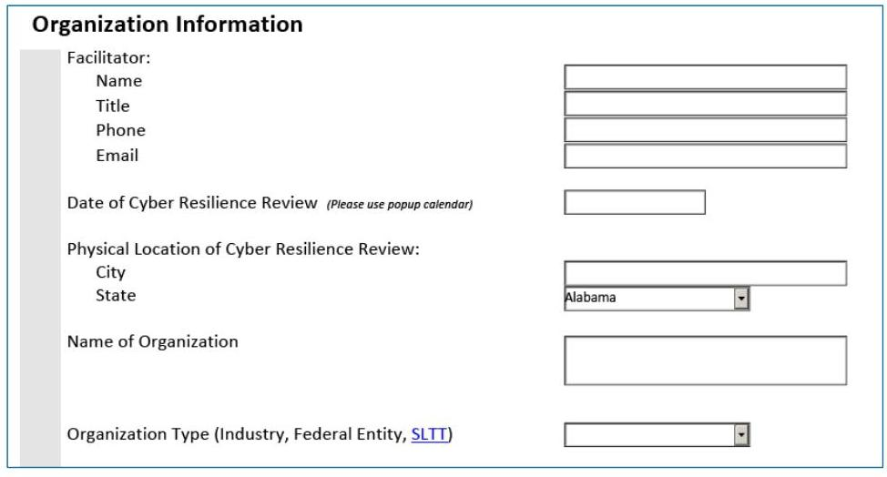

ในส่วนของการประเมินในแบบฟอร์ม จะประกอบด้วยกล่องเลือก (Checkboxes) ที่มีตัวเลือกคำตอบที่กำหนดไว้ล่วงหน้า โดยแต่ละคำถามจะมีตัวเลือก 3 ระดับ:

- **Yes (ใช่):** องค์กรดำเนินกิจกรรมตามที่ระบุในคำถามอย่างครบถ้วน
- **No (ไม่ใช่):** องค์กรไม่ได้ดำเนินกิจกรรมนั้นเลย
- **Incomplete (ไม่สมบูรณ์):** องค์กรดำเนินกิจกรรมนั้นเพียงบางส่วน

CRR แบ่งสินทรัพย์ออกเป็น 4 หมวดหมู่:

1. บุคลากร (People)
2. ข้อมูล (Information)
3. เทคโนโลยี (Technology)
4. สถานที่ (Facilities)

บางคำถามจะต้องให้คำตอบแยกตามแต่ละสินทรัพย์ ส่วนบางคำถามจะใช้คำตอบเดียวกับทุกหมวดสินทรัพย์ (ดูตัวอย่างในภาพที่ 3)

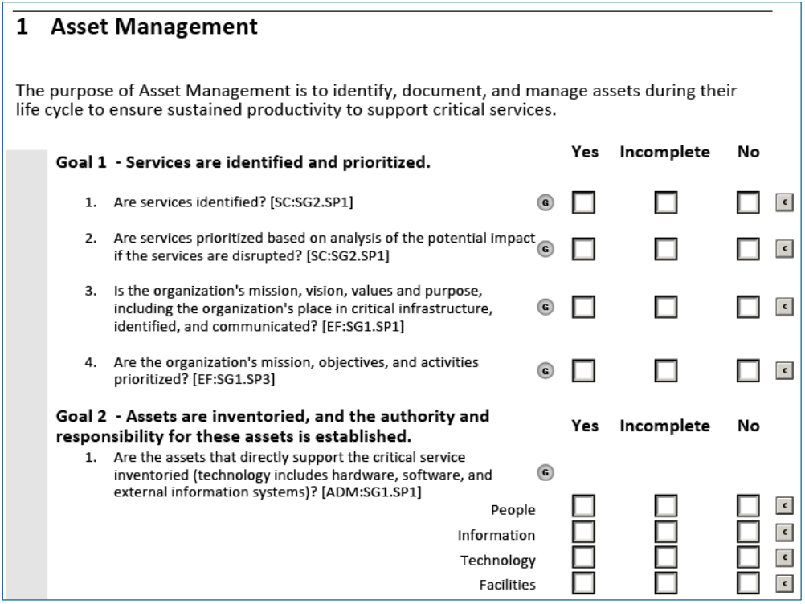

แต่ละคำถามจะมีปุ่ม **Clear** สำหรับล้างคำตอบได้ตามต้องการ และจะมีคำแนะนำปรากฏเมื่อเลื่อนเมาส์ไปวางเหนือไอคอน (ดูภาพที่ 4)

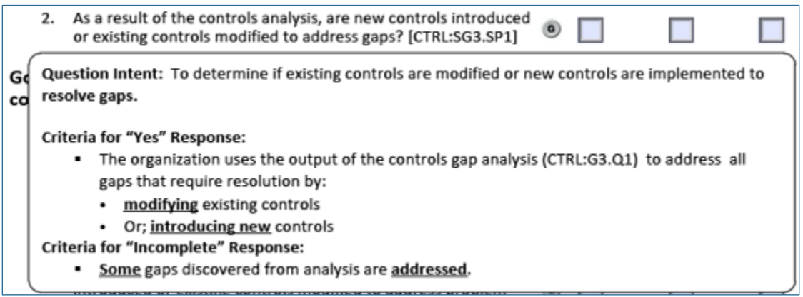

#### ช่องบันทึกข้อสังเกตเพิ่มเติม

ท้ายแต่ละโดเมน จะมีช่องชื่อว่า **Other Observations** (ดูภาพที่ 5) เพื่อบันทึกข้อคิดเห็นเพิ่มเติม เช่น เหตุผลประกอบคำตอบ หรือข้อมูลเฉพาะขององค์กร ข้อความที่พิมพ์ในช่องนี้จะถูกคัดลอกไปใส่ในรายงานโดยตรง

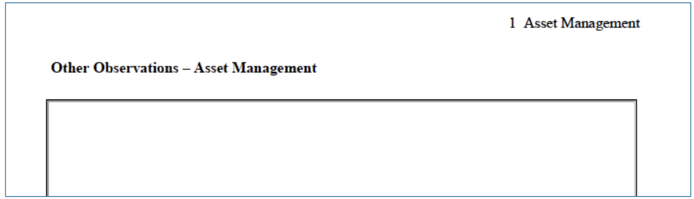

> **คำแนะนำ:** ควรบันทึกไฟล์เป็นระยะ เพื่อป้องกันการสูญหายของข้อมูล

#### การสร้างรายงาน (Generating the Report)

เมื่อผู้ประสานงานกรอกข้อมูลทั้งหมดและบันทึกไฟล์เรียบร้อยแล้ว ให้คลิกปุ่ม **Generate Report** ที่อยู่ในหน้าเปลี่ยนตอน (Transition Page) เพื่อสร้างรายงานอัตโนมัติ

- หน้า Transition จะปรากฏทั้งตอนต้นและท้ายของแบบฟอร์มเพื่อความสะดวก
- Adobe จะวิเคราะห์คำตอบและสร้างรายงานในส่วนท้ายของเอกสารโดยอัตโนมัติ
- สามารถพิมพ์รายงานได้โดยคลิกปุ่ม **Print Report** ที่หน้า Transition เช่นกัน
- ขณะดูรายงาน หน้า Transition จะอยู่ถัดจากหน้าชื่อรายงานโดยตรง

### 4 การตีความรายงานการประเมินตนเองด้วย CRR (Interpreting the CRR Self-Assessment Report)

#### 4.1 การให้คะแนนของ CRR (CRR Scoring)

คะแนนของแนวปฏิบัติจะส่งผลต่อคะแนนของเป้าหมาย และคะแนนของเป้าหมายจะส่งผลต่อคะแนนสุดท้ายของแต่ละโดเมน โดยแสดงในรูปแบบระดับวุฒิภาวะ (MIL Scale)

- คะแนน **MIL0 และ MIL1** แสดงถึงการดำเนินแนวปฏิบัติในระดับพื้นฐาน
- คะแนน **MIL2 ถึง MIL5** แสดงถึงระดับการฝังตัวของแนวปฏิบัติ (Institutionalization)

---

### กฎพื้นฐาน (Basic Rules)

1. แนวปฏิบัติจะถือว่า "ดำเนินการแล้ว (Yes)" หากมีการปฏิบัติตามครบถ้วน, "ดำเนินการไม่สมบูรณ์ (Incomplete)" หากดำเนินการเพียงบางส่วน และ "ไม่ได้ดำเนินการ (No)" หากไม่มีการดำเนินการเลย
2. เป้าหมายจะถ���อว่าบรรล���ผลได้���็ต���อเมื่อแ���วปฏิบัติทั���งห���ดใ���เป้าหมายนั้น��ูกดำ��นินการแล้ว (ตอบ Yes ทั้งหมด)
3. โดเมน���ะ���ื���ว���าบรรลุระดับ MIL1 ได้ก็ต่��เมื่อเป้าหมายทั้งหมดในโดเมนนั้นบรรลุผล
4. โดเมนจะสามารถบรรลุระดับ MIL ที่สูงขึ้น (MIL2 ถึง MIL5) ได้ ก็ต่อเมื่อคำถามในแต่ละระดับนั้น ๆ ได้รับคำตอบว่า "Yes" ครบทุกข้อ

---

### Scoring Rubric

#### Step 1: Score the Practice Performances per Domain

แต่ละแนวทางปฏิบัติ (practice) ภายในแต่ละโดเมนจะได้รับคะแนนตามเกณฑ์ต่อ���ปนี้:

- **ปฏิบัติแล้ว (performed)**: เมื่อตอบคำถามด้วย ��Yes” (สีเขียว)
- **ยังไม่ปฏิบัติ (not performed)**: เ���ื่���ตอบคำถ���มว่��� “Incomplete” (สีเหลือง), “No” (สี��ดง) หรือ “Not Answered” (สี����า)
- **หากเป็น "Not Answered" ((สีเทา)** คือคำถามถูกเว้นไว้และจะถือว่ามีค่าเท่ากับ “No”

#### Step 2: Score the Goal Achievement per Domain

แต่ละเป้าหมาย (goal) ในโดเมนจะได้รับคะแนนดังนี้:

- **บรรลุแล้ว (achieved)**: เมื่อแนวทางปฏิบัติทั้งหมดได้รับการปฏิบัติ (สีเขียว)
- **บรรลุบางส่วน (partially achieved)**: เมื่อบางแนวทางปฏิบัติได้รับการปฏิบัติ (สีเหลือง)
- **ไม่บรรลุ (not achieved)**: เมื่อไม่มีแนวทางปฏิบัติใดได้รับการปฏิบัติ (สีแดง)

#### Step 3: Score the Maturity Indicator Level per Domain

แต่ละโดเมนจะได้รับระดับ MIL ตามเกณฑ์ต่อไปนี้:

- **MIL0**: หากบรรลุเพียงบางเป้าหมายเท่านั้น
- **MIL1**: หากบรรลุทุกเป้าหมายในโดเมน
- **MIL2**: หากบรรลุ MIL1 และคำถามของ MIL2 ทุกข้อได้รับคำตอบ “Yes”
- **MIL3**: หากบรรลุ MIL2 และคำถามของ MIL3 ทุกข้อได้รับคำตอบ “Yes”
- **MIL4**: หากบรรลุ MIL3 และคำถามของ MIL4 ทุกข้อได้รับคำตอบ “Yes”
- **MIL5**: หากบรรลุ MIL4 และคำถามของ MIL5 ทุกข้อได้รับคำตอบ “Yes”

MIL (Maturity Indicator Level) จะถูกกำหนดให้แต่ละโดเมนและแสดงภาพรวมของประสิทธิภาพอย่างเป็นระบบ ระดับ MIL ที่อ้างอิงจาก CERT-RMM บ่งชี้ลักษณะที่แสดงถึงขีดความสามารถที่เติบโตและมีความมั่นคง แต่ควรทราบว่า MIL ไม่เหมือนกับระดับขีดความสามารถ (capability levels) ที่สามารถกำหนดได้หลังจากการประเมินแบบเป็นทางการเท่านั้น ไม่ใช่จากเครื่องมือประเมินแบบ self-assessment

#### 4.2 วิธีการตีความรายงาน (How to Interpret the Report)

**การใช้คะแนนผลการประเมิน**

องค์กรสามารถใช้รายงานการประเมินตนเองด้วย CRR เพื่อจัดทำแผนปฏิบัติการในการ:

- แก้ไขจุดอ่อนที่พบจากการประเมิน
- ใช้ประโยชน์จากจุดแข็งที่มีอยู่

จุดเริ่มต้นที่ดีในการวิเคราะห์คือ **สรุปผลการดำเนินงานของ CRR (CRR Performance Summary)** ดังที่แสดงในภาพตัวอย่าง (Figure 6)

> **ข้อควรทราบ:** องค์กรจะสามารถบรรลุระดับวุฒิภาวะที่สูงขึ้นได้ ก็ต่อเมื่อสามารถดำเนินแนวปฏิบัติทั้งหมดของระดับที่ต่ำกว่านั้นได้ครบถ้วน

กล่าวคือ หากองค์กรไม่สามารถดำเนินแนวปฏิบัติทั้งหมดที่ระดับ **MIL1** ได้ ก็จะไม่สามารถบรรลุ **MIL2** ได้ แม้ว่าจะตอบ "Yes" ต่อทุกข้อในระดับ MIL2 แล้วก็ตาม

ระดับ MIL เป็นเพียง **ตัวประมาณการวุฒิภาวะ** ขององค์กร โดยอิงจากลักษณะที่พึงมี หากผ่านกระบวนการประเมินอย่างเป็นทางการจริง ดังนั้นการบรรลุ MIL ใด ๆ **ไม่ได้หมายถึงขีดความสามารถที่แน่นอน (absolute capability)** แต่เป็นสิ่งบ่งชี้ว่ามีขีดความสามารถในระดับหนึ่งที่น่าเชื่อถือ

มาตรวัด MIL จึงมีประโยชน์อย่างยิ่งใน:

- การมุ่งเน้นไปยังประเด็นที่ควรปรับปรุง
- การเปรียบเทียบระดับวุฒิภาวะระหว่างหลายโดเมนอย่างมีประสิทธิภาพ

แต่ MIL **ไม่เหมาะกับการใช้เป็นหลักฐานทางเทคนิคที่แน่นอน** สำหรับการแสดงระดับความสามารถในโดเมนเดียวโดยเฉพาะ

**สรุปผลการดำเนินงาน (Performance Summary)** จะช่วยให้เห็นภาพเบื้องต้นในการตัดสินใจลงทุนปรับปรุงความมั่นคงไซเบอร์ โดยเฉพาะเมื่อสามารถระบุแนวปฏิบัติที่ยังไม่ได้ดำเนินการ

ตามที่แสดงใน Figure 6 แผนผังแสดงผลแบบใช้สีแยกตามโดเมน รวมกับรายละเอียดของแต่ละโดเมน (เช่น Figure 8) จะช่วยให้องค์กรมองเห็นจุดที่ควรพัฒนาได้อย่างชัดเจน

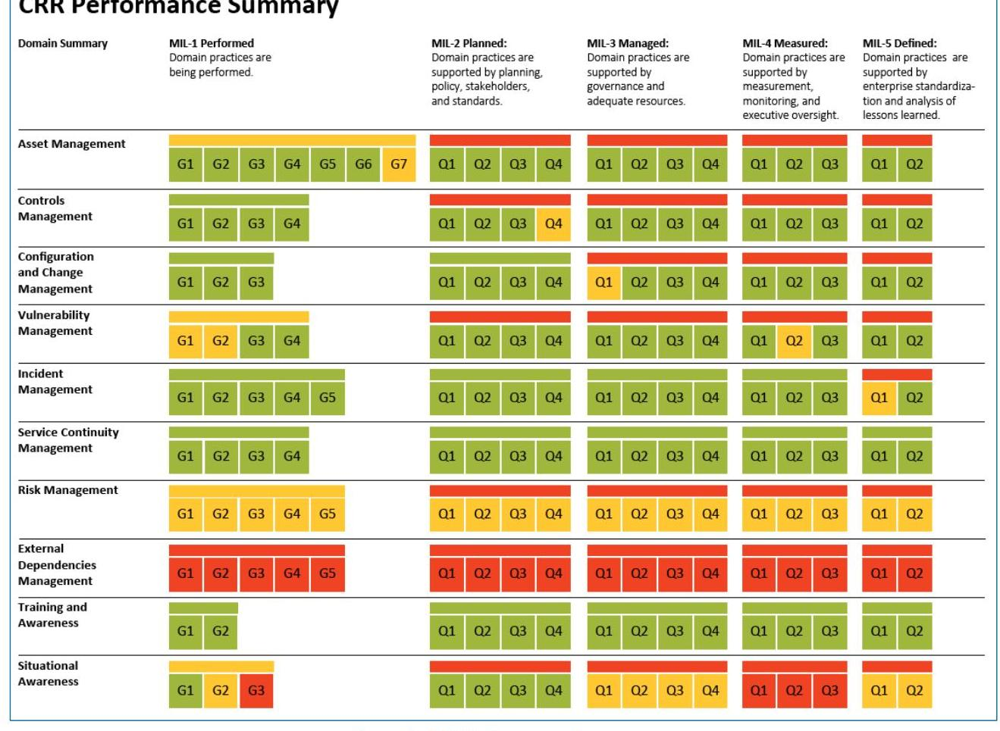

<em>Figure 6: CRR Performance Summary</em>

#### ภาพรวมผลการประเมิน (Overview)

แผนภาพภาพรวม (Overview) จะแสดงผลการประเมินขององค์กรในลักษณะแบบเส้นตรง โดยมีการใช้รหัสสีเพื่อสื่อถึงระดับการดำเนินการ:

- **MIL1** แสดงสถานะของการบรรลุเป้าหมาย:

  - สีเขียว (Green): บรรลุเป้าหมาย (ทุกแนวปฏิบัติที่เกี่ยวข้องได้รับการดำเนินการ)
  - สีเหลือง (Yellow): บรรลุเป้าหมายเพียงบางส่วน
  - สีแดง (Red): ไม่บรรลุเป้าหมาย

- **MIL2 ถึง MIL5** แสดงสถานะของการดำเนินแนวปฏิบัติในแต่ละระดับ:

  - สีเขียว (Green): ได้ดำเนินการแนวปฏิบัตินั้นแล้ว
  - สีเหลือง (Yellow): ดำเนินการบางส่วน
  - สีแดง (Red): ยังไม่ได้ดำเนินการ

เป้าหมายทั่วไปขององค์กรในการพัฒนาอาจเริ่มจาก **การบรรลุ MIL1 ในทุกโดเมน** ก่อน จากนั้นพิจารณา **พัฒนาโดเมนอื่นเพิ่มเติม** ตามความเสี่ยงที่องค์กรยอมรับได้ (risk tolerance)

องค์กรสามารถใช้ภาพรวมนี้เป็นแนวทางในการ:

- จัดลำดับความสำคัญของแนวปฏิบัติที่ควรปรับปรุง
- เลือกโดเมนที่ต้องการพัฒนาเป็นพิเศษ
- วางแผนเพื่อดำเนินการตามแนวปฏิบัติในระดับที่สูงขึ้นในลำดับถัดไป

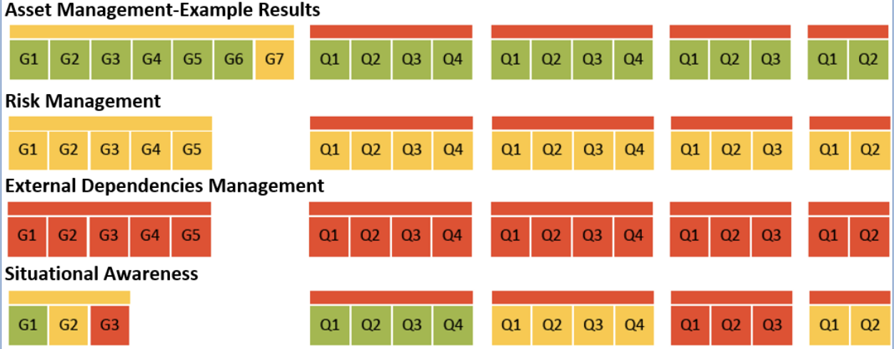

<em>Figure 7: A Sampling of Individual Domains</em>

#### การใช้ผลลัพธ์เพื่อกำหนดแนวทางปรับปรุง (ตาม Figure 7)

จาก **ภาพที่ 7** แสดงให้เห็นว่าโดเมนต่อไปนี้ **ยังไม่สามารถบรรลุระดับ MIL1 ได้**:

- การจัดการทรัพยากร (Asset Management)
- การจัดการความเสี่ยง (Risk Management)
- การจัดการการพึ่งพาภายนอก (External Dependencies Management)
- การรับรู้สถานการณ์ (Situational Awareness)

องค์กรควร **กำหนดเส้นทางการพัฒนา** ตามความจำเป็นและบริบทของตนเอง เช่น:

- หากองค์กร **พึ่งพาผู้ให้บริการภายนอก** ในการให้บริการสำคัญ และยังไม่มีการดำเนินแนวปฏิบัติในโดเมน External Dependencies Management เลย องค์กรอาจต้องเริ่มการปรับปรุงในโดเมนนี้ก่อน

- หากองค์กรมีปัญหาเรื่อง **การไม่ปฏิบัติตามข้อกำหนดทางกฎหมายหรือข้อบังคับ** (Regulatory Compliance) และหากไม่ได้รับการแก้ไขอาจก่อให้เกิดค่าใช้จ่าย องค์กรควรเร่งดำเนินการในแนวปฏิบัติที่เกี่ยวข้องก่อนเป็นอันดับแรก

รายงานของแต่ละโดเมน (ตามที่แสดงใน **ภาพที่ 8 และ 9**) จะให้รายละเอียดในระดับคำถาม เพื่อช่วยให้องค์กรมุ่งเน้นไปที่แนวปฏิบัติเฉพาะจุดที่ควรได้รับการปรับปรุง

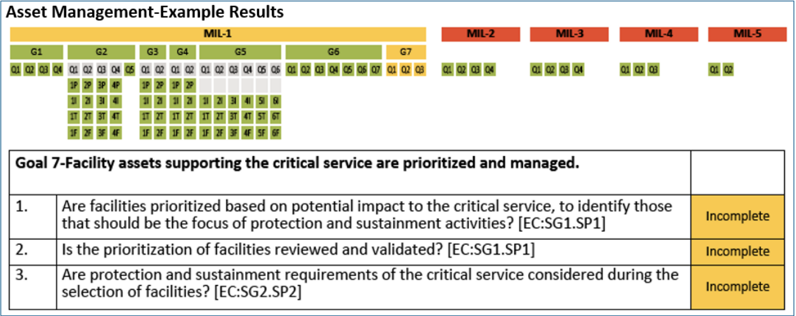

<em>Figure 8: Asset Management Individual Domain Report</em>

#### ตัวอย่างสถานการณ์ในโดเมน Asset Management (อิงจาก Figure 8)

ในตัวอย่างสถานการณ์ของโดเมน **Asset Management** ที่แสดงใน **ภาพที่ 8**:

องค์กรอาจได้รับประโยชน์จากการมุ่งเน้นไปที่ **การจัดลำดับความสำคัญ การทบทวน และข้อกำหนดด้านความยืดหยุ่นของสถานที่ปฏิบัติงาน (facilities)** เพื่อเลื่อนระดับจากสถานะปัจจุบันที่ **MIL1** ไปยัง **MIL5** ได้ เนื่องจากแนวปฏิบัติอื่น ๆ ได้รับการดำเนินการครบถ้วนแล้ว

อย่างไรก็ตาม การวิเคราะห์ความเสี่ยงขององค์กรอาจบ่งชี้ว่าแนวปฏิบัติใน **เป้าหมายที่ 7** ไม่ใช่เรื่องเร่งด่วน ตัวอย่างเช่น องค์กรมีเพียงสถานที่เดียวในการดำเนินงาน ซึ่งทำให้แนวปฏิบัติเกี่ยวกับการจัดลำดับความสำคัญของสถานที่อาจไม่มีความสำคัญมากนัก

ดังนั้น องค์กรควร **มุ่งเน้นไปที่การปรับปรุงในบริเวณที่มีความเสี่ยงสูงที่สุด** แทนที่จะพยายามไล่ระดับ MIL เพื่อเป้าหมายด้านรูปธรรมเพียงอย่างเดียว

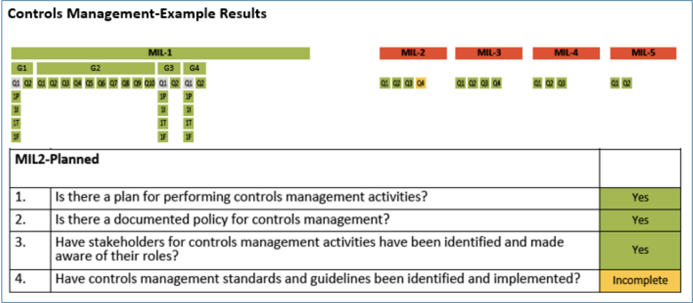

<em>Figure 9: Controls Management Individual Domain Report</em>

#### ตัวอย่างสถานการณ์ในโดเมน Controls Management (อิงจาก Figure 9)

ในตัวอย่างสถานการณ์ของโดเมน **Controls Management** ที่แสดงใน **ภาพที่ 9**:

สิ่งเดียวที่องค์กรจำเป็นต้องดำเนินการเพิ่มเติมเพื่อให้บรรลุ **MIL2** คือ **การนำมาตรฐานและแนวทางไปใช้ในการจัดการควบคุม (controls management)** ซึ่งถือว่าเป็นงานที่อาจไม่ซับซ้อนมากนัก หากดำเนินการเสร็จสิ้นแล้ว องค์กรจะสามารถบรรลุ **MIL5** ได้ทันที เพราะแนวปฏิบัติอื่น ๆ ได้รับการดำเนินการครบแล้ว

อย่างไรก็ตาม หากพิจารณาโดเมนอื่น ๆ เช่น:

- การกำหนดค่าและการเปลี่ยนแปลง (Configuration and Change Management)
- การฝึกอบรมและการสร้างความตระหนักรู้ (Training and Awareness)
- การจัดการเหตุการณ์ (Incident Management)

จะพบว่าองค์กรได้ดำเนินการในระดับ MIL ที่สูงกว่าแล้ว ดังนั้นความพยายามขององค์กรอาจควรมุ่งเน้นไปที่ **โดเมนที่ยังไม่บรรลุแม้แต่ระดับ MIL1** ซึ่งอาจมีความจำเป็นเร่งด่วนมากกว่า

#### สรุปผลการดำเนินงานในระดับ MIL1 (อิงจาก Figure 10)

ภาพที่ 10 แสดง **สรุปผลการดำเนินงานระดับ MIL1** โดยละเอียดสำหรับแต่ละโดเมนของ CRR โดยมีข้อมูลดังนี้:

- ข้อความเป้าหมาย (Goal Statement)
- แผนภาพแสดงจำนวนแนวปฏิบัติที่: ได้รับการดำเนินการ / ดำเนินการไม่สมบูรณ์ / ยังไม่ได้ดำเนินการ
- สรุปผลแนวปฏิบัติ MIL1 สำหรับแต่ละโดเมน
- สรุปรวมผลการดำเนินงานระดับ MIL1 สำหรับทั้ง CRR

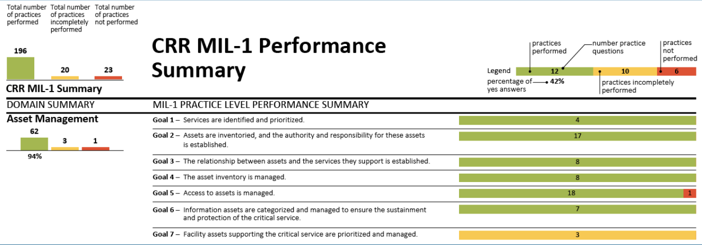

<em>Figure 10: CRR Performance Summary at MIL1</em>

#### ภาพสรุปผลการดำเนินงานระดับ MIL1 เชิงลึก (อิงจาก Figure 11)

ในลักษณะเดียวกันกับภาพก่อนหน้า **ภาพที่ 11** แสดงรายละเอียดการดำเนินงานระดับ **MIL1** ในเชิงลึกมากขึ้น โดยเฉพาะในโดเมน **Vulnerability Management**

จากตัวอย่างในภาพ:

- องค์กรสามารถสังเกตได้ว่า **สินทรัพย์ประเภทสถานที่ (facility assets)** มีการจัดการที่ด้อยกว่าเมื่อเทียบกับสินทรัพย์ประเภทอื่น ๆ

มุมมองในลักษณะนี้ช่วยให้สามารถระบุ **ความไม่สอดคล้อง (discrepancies)** ในการจัดการสินทรัพย์แต่ละประเภทได้อย่างชัดเจน และสามารถนำไปใช้เพื่อวางแผนการปรับปรุงในจุดที่อ่อนแอได้

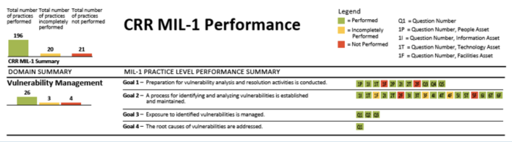

<em>Figure 11: CRR MIL-1 Performance – Vulnerability Management</em>

#### ภาพสรุปผลการดำเนินงานโดยรวมของ CRR (อิงจาก Figure 12 และภาคผนวก A)

นอกจากนี้ **ภาพที่ 12** ซึ่งอยู่ใน **ภาคผนวก A** ของรายงาน จะให้ **มุมมองการดำเนินงานโดยละเอียดครอบคลุมทั้ง CRR**

ภาพนี้แสดงผลการดำเนินงานในทุกโดเมนอย่างชัดเจน และสามารถใช้เป็นข้อมูลสนับสนุนในการวางแผนการปรับปรุงโดยรวมขององค์กร

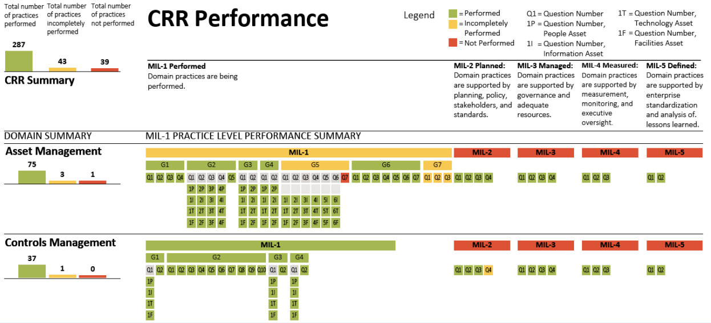

<em>Figure 12: CRR Performance View</em>

#### การใช้ภาพ Figure 13 และ Figure 14 ประกอบกันเพื่อวิเคราะห์ผลลัพธ์

**Figure 13: Summary of CRR Results** และ **Figure 14: Percentage of Practices Completed by Domain** ควรถูกใช้ร่วมกันเมื่อวิเคราะห์ผลลัพธ์

เพื่อแสดงประเด็นนี้ให้ชัดเจน ลองพิจารณาส่วนของ **โดเมน Asset Management**:

- ใน **Figure 13** แสดงว่าโดเมน Asset Management **ยังไม่บรรลุระดับ MIL1**
- แต่ใน **Figure 14** กลับแสดงว่า **95% ของแนวปฏิบัติในโดเมน Asset Management ได้รับการดำเนินการแล้ว**

สิ่งนี้สะท้อนให้เห็นว่า แม้แนวปฏิบัติจะได้รับการดำเนินการในสัดส่วนสูง แต่หากยัง **ขาดเพียงบางแนวปฏิบัติในระดับพื้นฐาน (MIL1)** ก็จะไม่สามารถบรรลุระดับ MIL ใด ๆ ได้เลย เนื่องจากระดับ MIL มีลักษณะ **สะสม (Cumulative)**

> กล่าวคือ: ต้องดำเนินแนวปฏิบัติให้ครบในทุกระดับที่ต่ำกว่า จึงจะสามารถเลื่อนไปสู่ระดับ MIL ที่สูงกว่าได้

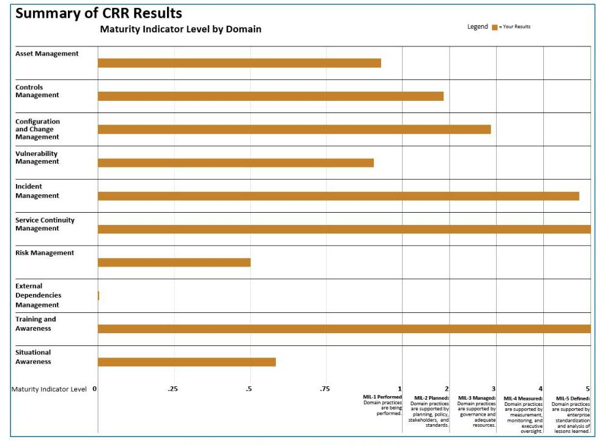

<em>Figure 13: Summary of CRR Results</em>

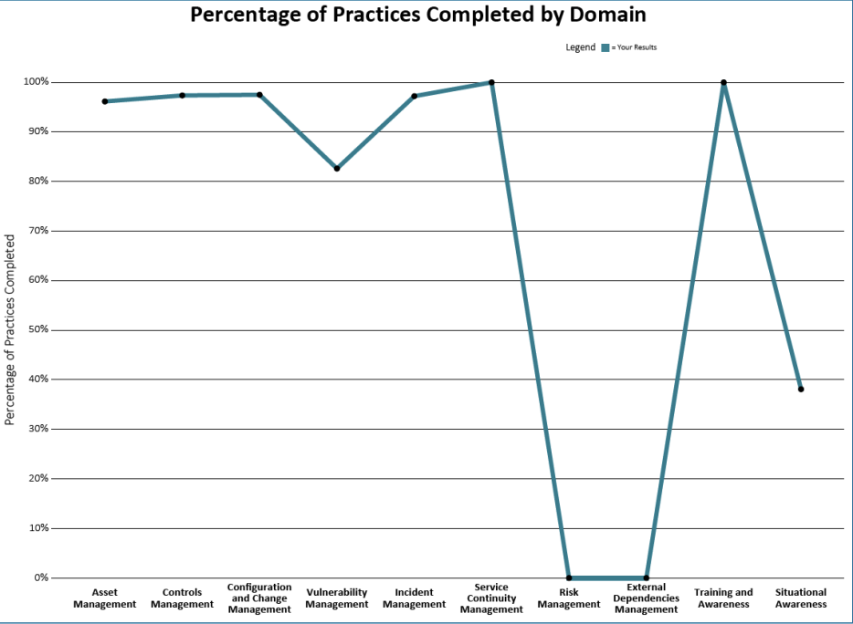

<em>Figure 14: Percentage of Practices Completed by Domain</em>

#### การให้คะแนนตามกรอบงาน NIST Cybersecurity Framework (NIST CSF Scoring Depictions)

การประเมินตนเองด้วย CRR ยังเปิดโอกาสให้องค์กรสามารถ **ประเมินขีดความสามารถของตนเองเทียบกับกรอบงาน NIST Cybersecurity Framework (CSF)** ได้อีกด้วย

แนวปฏิบัติแต่ละข้อของ CRR ได้รับการแมป (mapped) เข้ากับหมวดหมู่หลักและหมวดย่อยของ NIST CSF ที่เกี่ยวข้องโดยตรง

**Figure 15** แสดงผลลัพธ์ขององค์กรโดยแยกตามฟังก์ชันและหมวดหมู่ (Function & Category)

องค์กรสามารถใช้สรุปผลนี้เพื่อวางแผนและจัดลำดับความสำคัญในการพัฒนาแต่ละหมวดที่ตนเลือกได้ เช่น:

- องค์กรได้ดำเนินการแนวปฏิบัติ **63% ของแนวปฏิบัติทั้งหมดในฟังก์ชัน Identify**
- อย่างไรก็ตาม ผลลัพธ์ยังแสดงว่าองค์กร **ดำเนินการไม่สมบูรณ์ในทุกแนวปฏิบัติที่เกี่ยวข้องกับหมวด Risk Management Strategy**

ดังนั้น องค์กรอาจตัดสินใจ **ให้ความสำคัญกับการดำเนินแนวปฏิบัติที่ช่วยปรับปรุงหมวด Risk Management Strategy** เป็นลำดับแรก

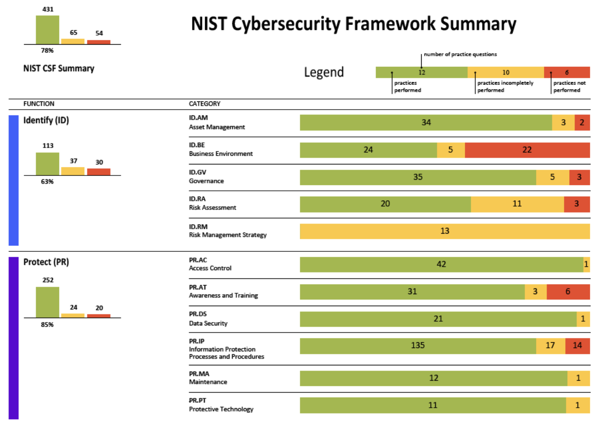

<em>Figure 15: NIST Cybersecurity Framework Summary</em>

#### ภาพการให้คะแนนเพิ่มเติมตาม NIST CSF (ต่อเนื่องจากภาคผนวก A)

นอกจากนี้ ยังมีภาพประกอบเพิ่มเติมจากกรอบงาน **NIST Cybersecurity Framework (CSF)** อยู่ใน **ภาคผนวก A** ที่แสดงรายละเอียดเชิงลึกมากขึ้นของแต่ละหมวดหมู่ (Category) และหมวดย่อย (Subcategory)

**Figure 16** แสดงผลการดำเนินงานขององค์กรในหมวด **Identify Function – Asset Management (ID.AM)** โดยอิงจากคำตอบในแบบประเมิน CRR

> **ข้อควรทราบ:** หมวด **ID.AM** มีแนวปฏิบัติของ CRR ที่เชื่อมโยงอยู่ **จำนวน 19 ข้อ** ซึ่งไม่ได้หมายถึงการรวมแนวปฏิบัติจากหมวดย่อยทั้งหมดที่ปรากฏทางด้านขวาของกราฟ

เหตุผลที่มี 19 แนวปฏิบัติของ CRR ที่เชื่อมโยงกับหมวด ID.AM ก็เพราะว่า แนวปฏิบัติเหล่านี้แสดงถึงสิ่งที่องค์กรควรดำเนินการ **ในฐานะส่วนหนึ่งของโปรแกรมการบริหารจัดการทรัพยากร (Asset Management Program)**

แม้ว่าจะไม่มีหมวดย่อยใดใน NIST CSF ที่ตรงกับแนวปฏิบัติเหล่านี้แบบตรง ๆ ก็ตาม แต่แนวปฏิบัติเหล่านี้มีความสำคัญและควรได้รับการพิจารณาในการประเมินความพร้อมด้านความมั่นคงไซเบอร์ขององค์กร

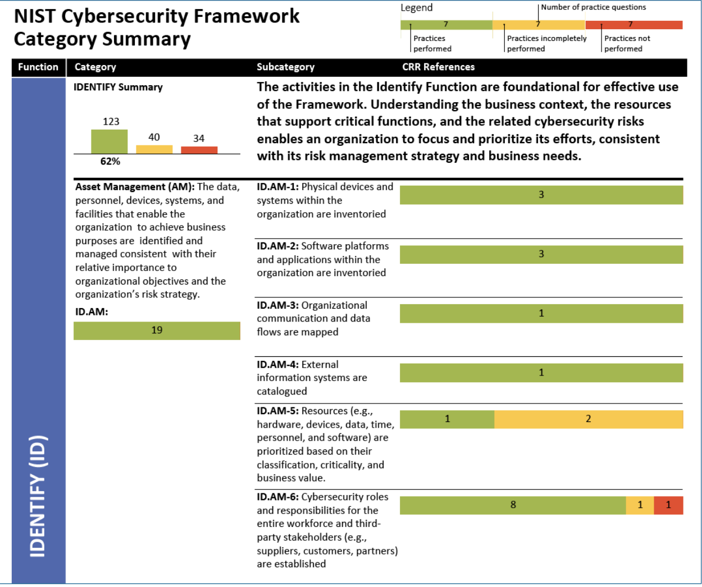

<em>Figure 16: NIST Cybersecurity Framework Category Summary</em>

#### ภาพการประเมินผลตามหมวดของ NIST CSF (อิงจาก Figure 17)

องค์กรยังสามารถใช้ **ภาพการประเมินผลตามหมวดของ NIST Cybersecurity Framework (CSF)** ที่แสดงใน **Figure 17** เพื่อดูความครอบคลุมของตนในแต่ละหมวดและหมวดย่อยของ NIST CSF รวมถึงใช้เพื่อติดตามความคืบหน้าในการปรับปรุงแนวปฏิบัติขององค์กร

ภาพนี้ทำหน้าที่เป็น **แผนภาพ crosswalk แบบไดนามิก** ที่ใช้งานสะดวก ผู้ใช้งานสามารถอ้างอิงได้อย่างรวดเร็วว่า **แนวปฏิบัติของ CRR ใดเชื่อมโยงกับหมวดหรือหมวดย่อยของ NIST CSF ใด**

ด้วยเหตุนี้ องค์กรจึงสามารถใช้ภาพนี้เพื่อวางแผนการพัฒนาและกำหนดลำดับความสำคัญในการปรับปรุงความมั่นคงปลอดภัยทางไซเบอร์ได้อย่างมีประสิทธิภาพ

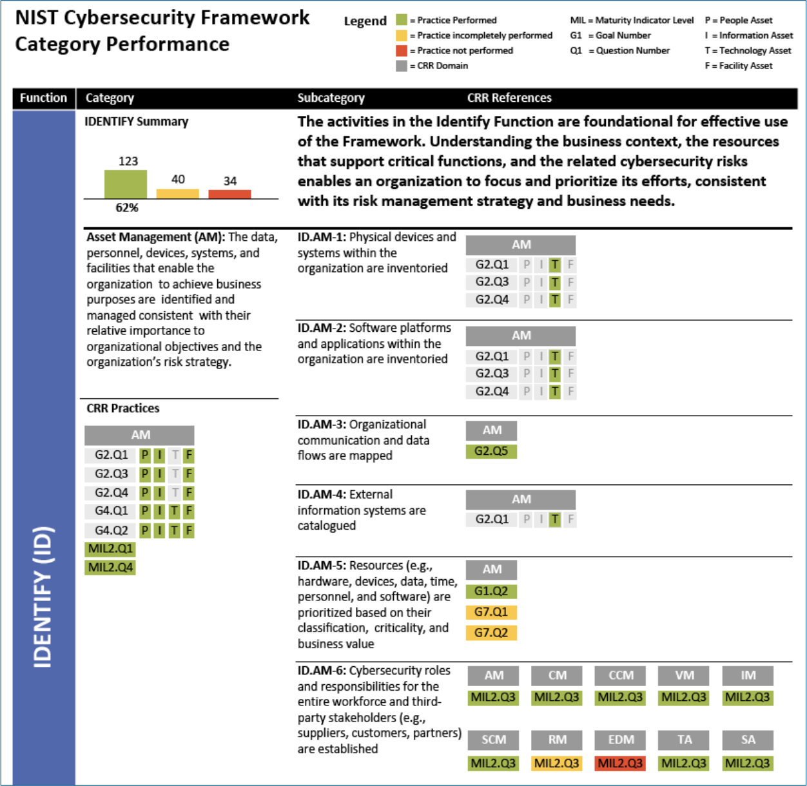

<em>Figure 17: NIST Cybersecurity Framework Category Performance</em>

#### ตัวเลือกเพื่อการพิจารณา (Options for Consideration)

รายงานการประเมินตนเองด้วย CRR จะรวมถึง **แนวทางที่องค์กรอาจใช้ในการปรับปรุงการดำเนินแนวปฏิบัติในแต่ละข้อ** โดยจะแสดงในรูปแบบ **ตาราง (grid)** ใต้ผลลัพธ์ของแต่ละเป้าหมายในแต่ละโดเมน (ดูตัวอย่างใน **Figure 18**)

ตารางตัวเลือกนี้ช่วยให้องค์กรสามารถ:

- มองเห็นแนวทางที่เป็นไปได้ในการพัฒนาแต่ละแนวปฏิบัติที่ยังไม่สมบูรณ์
- ใช้เป็นจุดเริ่มต้นในการวางแผนปรับปรุงตามบริบทเฉพาะขององค์กร

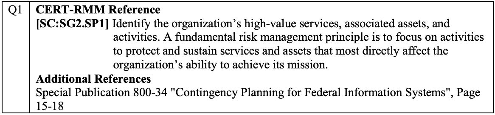

<em>Figure 18: Option for Consideration</em>

#### แหล่งที่มาของ Options for Consideration

ตัวเลือกเพื่อการพิจารณา (Options for Consideration) ส่วนใหญ่มีที่มาจาก:

- โมเดล **CERT-RMM (CERT Resilience Management Model)**
- สิ่งพิมพ์พิเศษของ **NIST** (NIST Special Publications)

ภาคผนวก C ของคู่มือนี้ให้รายการแหล่งที่มาฉบับเต็ม

ตัวเลือกที่มาจาก CERT-RMM จะอ้างอิงกลับไปยัง **เป้าหมายและแนวปฏิบัติเฉพาะที่เกี่ยวข้องโดยตรง** โดยมีรูปแบบรหัสอ้างอิงมาตรฐานดังนี้:

> **process area\:specific goal.specific practice**

ตัวอย่างใน **Figure 18**:

- คำถามที่ 1 (Q1) มีการอ้างอิง CERT-RMM ไปยัง:

  - **Service Continuity\:Specific Goal 2.Specific Practice 1**

ซึ่งแสดงถึงความเชื่อมโยงระหว่างคำถาม CRR กับแนวปฏิบัติใน CERT-RMM เพื่อช่วยให้องค์กรสามารถดำเนินการปรับปรุงตามแนวทางที่สอดคล้องกับโมเดลความมั่นคงปลอดภัยระดับสูง

#### 4.3 การระบุช่องว่าง (Identify Gaps)

การประเมินตนเองด้วย CRR จะประเมินระดับวุฒิภาวะ (Maturity) ขององค์กรใน **10 โดเมนด้านความมั่นคงปลอดภัยไซเบอร์** และจะช่วยระบุ **ช่องว่างเฉพาะเจาะจง (Gaps)** ที่สามารถใช้เป็นจุดเริ่มต้นของ **โครงการปรับปรุงกระบวนการ (Process Improvement Project)** ได้

แผนการปรับปรุงจะถูกกำหนดโดยอิงจากปัจจัยสำคัญดังนี้:

- การประเมินผลลัพธ์จากแบบประเมินตนเอง
- การระบุช่องว่างของการดำเนินแนวปฏิบัติในแต่ละโดเมน
- การปรับแนวปฏิบัติของแต่ละโดเมนให้สอดคล้องกับ:

  - พันธกิจขององค์กร (Mission)
  - วัตถุประสงค์เชิงกลยุทธ์ (Strategic Objectives)
  - ความเสี่ยงที่มีต่อโครงสร้างพื้นฐานที่สำคัญ (Risk to Critical Infrastructure)
  - ซึ่งนำไปสู่การกำหนดระดับวุฒิภาวะเป้าหมาย (Target Maturity Level) ของแต่ละโดเมน

- การทบทวนตัวเลือกเพื่อการพิจารณาที่ระบบแนะนำไว้ (Options for Consideration)

**ตารางที่ 5** จะให้คำอธิบายเพิ่มเติมเกี่ยวกับกิจกรรมต่าง ๆ ในการปรับปรุงกระบวนการอย่างละเอียด

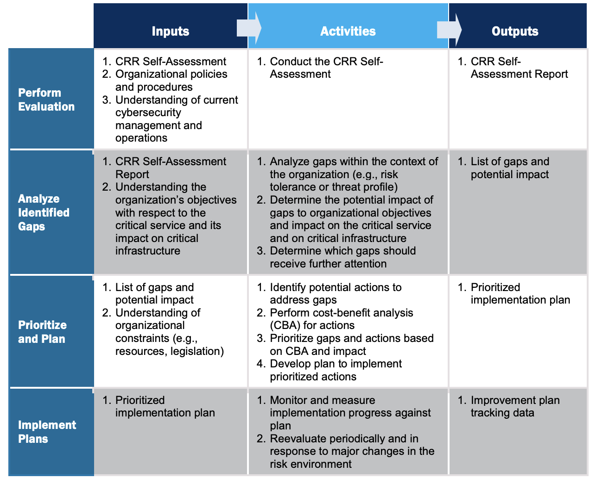

<em>Table 5: Recommended Process for Using Results</em>

### 5 การปรับปรุง (Making Improvements)

CRR **ไม่ได้กำหนดให้ทุกองค์กรในแต่ละภาคส่วนต้องบรรลุระดับ MIL ใดเป็นพิเศษ**

อย่างไรก็ตาม **รายงานการประเมินตนเอง CRR** จะให้ข้อมูลเกี่ยวกับ **ระดับขีดความสามารถด้านความมั่นคงปลอดภัยไซเบอร์ในปัจจุบัน** ขององค์กรในแต่ละ 10 โดเมนของ CRR ซึ่งสามารถใช้เป็น **จุดเริ่มต้น (baseline)** สำหรับการเริ่มต้นโครงการปรับปรุงกระบวนการที่ขับเคลื่อนด้วยข้อมูล (data-driven process improvement project)

ตามภาพประกอบใน **Figure 19** การปรับปรุงสามารถออกแบบโดยอิงจากผลการประเมิน เพื่อยกระดับความสามารถขององค์กรอย่างมีทิศทางและตามบริบทความเสี่ยงเฉพาะ

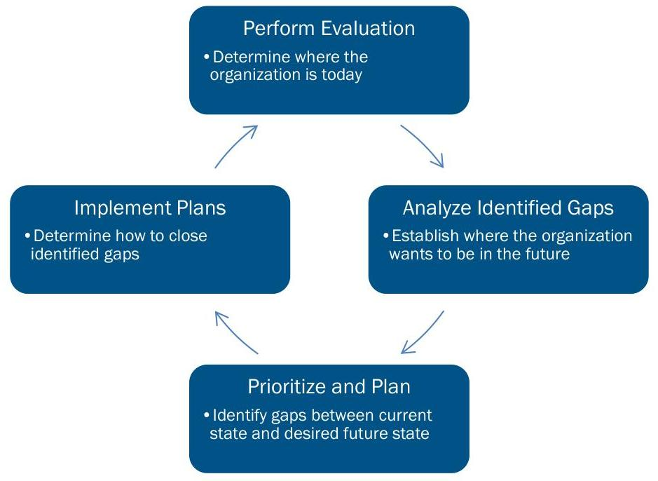

<em>Figure 19: Steps in a Typical Process Improvement Activity</em>

ส่วนนี้จะมุ่งเน้นไปที่ **3 ขั้นตอนหลักของโครงการปรับปรุงกระบวนการ** ที่จะดำเนินการหลังจากการประเมินตนเองเสร็จสิ้น:

1. **วิเคราะห์ช่องว่างที่ระบุไว้ (Analyze Identified Gaps)**
2. **กำหนดลำดับความสำคัญและวางแผน (Prioritize and Plan)**
3. **ดำเนินการตามแผน (Implement Plans)**

### 5.1 วิเคราะห์ช่องว่างที่ระบุไว้ (Analyze Identified Gaps)

รายงานการประเมินตนเองของ CRR จะมี **กราฟและตาราง** ที่แสดงการวิเคราะห์ตามคำตอบที่บันทึกไว้:

- แผนภูมิสรุปแสดงระดับ MIL ที่บรรลุในแต่ละโดเมน
- ตารางรายละเอียดแสดงคำตอบของแต่ละคำถาม

กราฟและตารางเหล่านี้จะแสดงให้เห็นว่าองค์กรมีคะแนนอย่างไรเมื่อเทียบกับเกณฑ์ของ CRR

> **คำแนะนำสำคัญ:** องค์กร **ไม่จำเป็นต้องพยายามบรรลุ MIL สูงสุดในทุกโดเมน**

องค์กรควรกำหนดระดับการดำเนินแนวปฏิบัติและระดับ MIL ที่เหมาะสมกับ **วัตถุประสงค์ทางธุรกิจและกลยุทธ์ด้านความมั่นคงไซเบอร์** ของตน

คอลเลกชันของความสามารถที่ต้องการนี้เรียกว่า **สภาพเป้าหมาย (Target State)** ของการดำเนินแนวปฏิบัติและระดับ MIL

มี **2 แนวทางทั่วไป** ในการกำหนดเป้าหมาย:

1. ใช้ **ผลลัพธ์จากการประเมิน CRR** เป็นพื้นฐานในการกำหนดเป้าหมาย – วิธีนี้นิยมใช้ในองค์กรที่เพิ่งเริ่มต้นหรือยังไม่มีเป้าหมายที่ชัดเจนมาก่อน
2. เดินผ่านแนวปฏิบัติต่าง ๆ เพื่อกำหนดเป้าหมาย **ก่อนทำการประเมิน** – วิธีนี้เหมาะกับองค์กรที่มีประสบการณ์และความคุ้นเคยกับแนวปฏิบัติของ CRR แล้ว

### 5.1 วิเคราะห์ช่องว่างที่ระบุไว้ (Analyze Identified Gaps)

รายงานการประเมินตนเองของ CRR จะมี **กราฟและตาราง** ที่แสดงการวิเคราะห์ตามคำตอบที่บันทึกไว้:

- แผนภูมิสรุปแสดงระดับ MIL ที่บรรลุในแต่ละโดเมน
- ตารางรายละเอียดแสดงคำตอบของแต่ละคำถาม

กราฟและตารางเหล่านี้จะแสดงให้เห็นว่าองค์กรมีคะแนนอย่างไรเมื่อเทียบกับเกณฑ์ของ CRR

> **คำแนะนำสำคัญ:** องค์กร **ไม่จำเป็นต้องพยายามบรรลุ MIL สูงสุดในทุกโดเมน**

องค์กรควรกำหนดระดับการดำเนินแนวปฏิบัติและระดับ MIL ที่เหมาะสมกับ **วัตถุประสงค์ทางธุรกิจและกลยุทธ์ด้านความมั่นคงไซเบอร์** ของตน

คอลเลกชันของความสามารถที่ต้องการนี้เรียกว่า **สภาพเป้าหมาย (Target State)** ของการดำเนินแนวปฏิบัติและระดับ MIL

มี **2 แนวทางทั่วไป** ในการกำหนดเป้าหมาย:

#### แนวทางที่ 1: ตั้งเป้าหมายโดยใช้ผลลัพธ์จากการประเมิน (Setting a Target: Method 1)

ในแนวทางนี้ องค์กรจะใช้ **ผลลัพธ์จากแบบประเมิน CRR ที่เสร็จสมบูรณ์แล้ว** เพื่อเริ่มต้นการกำหนดสภาพเป้าหมาย (Target State) โดยดำเนินการดังนี้:

1. ตรวจสอบแนวปฏิบัติทั้งหมดที่ได้รับคำตอบว่า "No"
2. สำหรับแต่ละแนวปฏิบัติที่ได้ "No" ให้พิจารณาว่า แนวปฏิบัตินั้น **จำเป็นต้องดำเนินการ** เพื่อให้บรรลุวัตถุประสงค์ทางธุรกิจและไซเบอร์ขององค์กรหรือไม่
3. หากแนวปฏิบัตินั้นจำเป็น ต้อง **บันทึกไว้**
4. หากไม่จำเป็น ให้ข้ามไปยังแนวปฏิบัติต่อไปที่ได้ "No"
5. ทำซ้ำขั้นตอนที่ 1–4 สำหรับแนวปฏิบัติทั้งหมดที่ได้ "Incomplete"
6. ทำซ้ำสำหรับทั้ง 10 โดเมนของโมเดล

เมื่อการทบทวนเสร็จสิ้น องค์กรจะมีรายการแนวปฏิบัติที่ **จำเป็นต้องดำเนินการ** ซึ่งเมื่อนำมารวมกับแนวปฏิบัติที่ดำเนินการอยู่แล้ว (แสดงไว้ในรายงานประเมินตนเอง) จะได้เป็นภาพรวมของ **สภาพเป้าหมายของการดำเนินแนวปฏิบัติขององค์กร (Target State of Practice Performance)**

ข้อดีของวิธีนี้คือ **รายการแนวปฏิบัติที่ต้องดำเนินการจะเป็นรายการช่องว่าง (Gap List) ที่ต้องได้รับการแก้ไขโดยตรง** ซึ่งสามารถนำไปใช้เป็นจุดเริ่มต้นของการจัดลำดับความสำคัญและการวางแผนได้

#### แนวทางที่ 2: ตั้งเป้าหมายก่อนการประเมิน (Setting a Target: Method 2)

ในแนวทางนี้ องค์กรจะ **พิจารณาแนวปฏิบัติของ CRR ทีละข้อก่อนเริ่มการประเมิน** เพื่อกำหนดสภาพเป้าหมายของการดำเนินแนวปฏิบัติและระดับ MIL ที่ต้องการ

โดยมีขั้นตอนดังนี้:

1. ทบทวนแต่ละแนวปฏิบัติ และพิจารณาว่าจำเป็นต้องดำเนินการหรือไม่ เพื่อให้บรรลุวัตถุประสงค์ทางธุรกิจและความมั่นคงไซเบอร์
2. หากจำเป็น ต้องบันทึกแนวปฏิบัตินั้นไว้
3. หากไม่จำเป็น ให้ข้ามไปยังแนวปฏิบัติถัดไปในโดเมน
4. ทำซ้ำสำหรับทั้ง 10 โดเมนของโมเดล

เมื่อดำเนินการเสร็จสิ้น องค์กรจะมีรายการแนวปฏิบัติที่เชื่อว่าจำเป็นต้องดำเนินการเพื่อให้บรรลุเป้าหมายขององค์กร

รายการนี้จะกลายเป็น **สภาพเป้าหมายของการดำเนินแนวปฏิบัติ** ซึ่งสามารถนำไปเปรียบเทียบกับผลลัพธ์ของการประเมิน เพื่อระบุช่องว่าง (Gaps) ที่จำเป็นต้องแก้ไขเพิ่มเติม

### 5.2 กำหนดลำดับความสำคัญและวางแผน (Prioritize and Plan)

หลังจากดำเนินการวิเคราะห์ช่องว่าง (Gap Analysis) เสร็จสิ้นแล้ว องค์กรควรทำการ **จัดลำดับความสำคัญของการดำเนินการ** ที่จำเป็นเพื่อให้สามารถดำเนินแนวปฏิบัติที่นำไปสู่การบรรลุขีดความสามารถที่ต้องการในแต่ละโดเมนได้อย่างสมบูรณ์

การจัดลำดับความสำคัญควรพิจารณาจากเกณฑ์ เช่น:

- ผลกระทบของช่องว่างต่อวัตถุประสงค์ขององค์กรและโครงสร้างพื้นฐานที่สำคัญ
- ความสำคัญของวัตถุประสงค์ทางธุรกิจที่โดเมนนั้นสนับสนุน
- ต้นทุนในการดำเนินแนวปฏิบัติที่จำเป็น
- ความพร้อมของทรัพยากรในการดำเนินแนวปฏิบัตินั้น ๆ

องค์กรสามารถใช้การวิเคราะห์ต้นทุน-ปร���โยชน์ (Cost-Benefit Analysis) เพื่อช่วยในการจัดลำดับความสำคัญของกิจกรรมที่จะดำเนินการ

จากนั้นองค์กรควร **จัดทำแผนดำเนินงานเพื่อปิดช่องว่างที่เลือกไว้** โดยมีเจ้าของแผน (Organizational Sponsor) รับผิดชอบโดยรวม และสามารถมอบหมายให้บุคคลที่ได้รับแต่งตั้งดำเนินการในรายละเอียดแทนได้

---

### 5.3 ดำเนินการตามแผน (Implement Plans)

เพื่อให้แผนประสบความสำเร็จ องค์กรต้อง **จัดสรรทรัพยากรอย่างเพียงพอ** ซึ่งรวมถึง:

- บุคลากรที่มีทักษะที่จำเป็นสำหรับการดำเนินภารกิจตามแผน
- งบประมาณที่เพียงพอ

นอกจากนี้ องค์กรต้อง **สนับสนุนการดำเนินแผนอย่างต่อเนื่อง** โดย:

- การติดตามความคืบหน้าของการดำเนินการ
- การยอมรับและให้ความสำคัญกับความสำเร็จที่เกิดขึ้นในแต่ละขั้นตอน

หลังจากได้พัฒนาและดำเนินการตามแผนเพื่อแก้ไขช่องว่างที่เลือกไว้แล้ว องค์กรควร:

- **ประเมินวัตถุประสงค์ทางธุรกิจและความเสี่ยงเป็นระยะ**
- พิจารณาว่าจำเป็นต้องปรับเปลี่ยนขีดความสามารถที่ต้องการหรือไม่

การประเมินซ้ำเป็นระยะโดยใช้ **CRR Self-Assessment Package** จะช่วยติดตามความก้าวหน้าไปสู่ขีดความสามารถเป้าหมายขององค์กร

### 6 สรุป (Summary)

เอกสารฉบับนี้อธิบายถึง **สถาปัตยกรรมของ Cyber Resilience Review (CRR)** พร้อมทั้งรายละเอียดของ **10 โดเมนหลักของ CRR** และ **6 ระดับตัวชี้วัดวุฒิภาวะ (Maturity Indicator Levels - MILs)**

เนื้อหายังครอบคลุม:

- แนวทางการเตรียมตัวสำหรับการประเมินตนเองด้วย CRR
- บทบาทของผู้ดำเนินการ (facilitator) ที่ช่วยองค์กรประเมินระดับวุฒิภาวะของขีดความสามารถด้านความมั่นคงไซเบอร์
- คำแนะนำในการดำเนินกิจกรรมหลังการประเมิน เช่น การจัดลำดับความสำคัญ และดำเนินแผนเพื่อปิดช่องว่างของขีดความสามารถที่ค้นพบจากการวิเคราะห์รายงานการประเมินตนเอง CRR

นอกจากนี้ CRR Self-Assessment ยังให้การประเมินขีดความสามารถขององค์กร **เมื่อเปรียบเทียบกับกรอบงาน NIST Cybersecurity Framework (CSF)** โดยในชุดเครื่องมือ CRR Self-Assessment Kit จะมีเอกสาร crosswalk ที่แมปความเชื่อมโยงระหว่างหมวด/หมวดย่อยของ NIST CSF กับเป้าหมายและแนวปฏิบัติของ CRR อย่างชัดเจน

หากผู้ดำเนินการหรือผู้เข้าร่วมต้องการความช่วยเหลือเพิ่มเติม สามารถติดต่อกระทรวงความมั่นคงแห่งมาตุภูมิ (DHS) ได้ที่:
**[cyberadvisor@hq.dhs.gov](mailto:cyberadvisor@hq.dhs.gov)**

# ภาคผนวก A: รายการตรวจสอบกระบวนการ (Process Checklist)

## รายการตรวจสอบสำหรับการประเมินตนเอง CRR (CRR Self-Assessment Checklist)

**วัตถุประสงค์:** ใช้เป็นแนวทางในการดำเนินการประเมินตนเองด้วย CRR

---

### กิจกรรมก่อนเวิร์กช็อป (Pre-Workshop Activities)

| เวลา                        | รายการ                  | คำอธิบาย                                                                                                                                                                                                                                                                          | เสร็จแล้ว |
| --------------------------- | ----------------------- | --------------------------------------------------------------------------------------------------------------------------------------------------------------------------------------------------------------------------------------------------------------------------------- | --------- |
| **4 สัปดาห์ก่อนเวิร์กช็อป** | ประชุมเตรียมความพร้อม   | - จัดประชุมเตรียมความพร้อม   - ตอบคำถามจากองค์กร   - กำหนดขอบเขตการประเมิน   - ระบุรายชื่อผู้เข้าร่วม   - กำหนดวันจัดเวิร์กช็อปประเมินตนเอง                                                                                                                           | ☐         |
| **2 สัปดาห์ก่อนเวิร์กช็อป** | สถานที่                 | - ตรวจสอบความพร้อมของสถานที่   - ห้องประชุมมีขนาดพอเพียงสำหรับผู้เข้าร่วมทั้งหมด   - จัดวางห้องเพื่ออำนวยความสะดวกในการสนทนา   - มีโปรเจกเตอร์และหน้าจอ   - แสงในห้องปรับให้เหมาะกับการฉายภาพ   - มีคอมพิวเตอร์ที่ติดตั้ง Adobe Reader หรือ Acrobat เวอร์ชันล่าสุด | ☐         |
|                             | อาหาร/เครื่องดื่ม       | - ยืนยันเรื่องการจัดอาหารและเครื่องดื่มหากมี                                                                                                                                                                                                                                      | ☐         |
| **1 สัปดาห์ก่อนเวิร์กช็อป** | ความพร้อมของผู้เข้าร่วม | - ยืนยันการเข้าร่วมของผู้มีส่วนเกี่ยวข้องทั้งหมด                                                                                                                                                                                                                                  | ☐         |

#### ตารางความพร้อมของผู้เข้าร่วม (Participant Availability Table)

| ชื่อ | ตำแหน่ง | บทบาท (โดเมน CRR) |
| ---- | ------- | ----------------- |
|      |         | AM                |
|      |         | CM                |
|      |         | CCM               |
|      |         | VM                |
|      |         | IM                |
|      |         | SCM               |
|      |         | RM                |
|      |         | EDM               |
|      |         | TA                |
|      |         | SA                |

---

### กิจกรรมหลังเวิร์กช็อป (Post-Workshop Activities)

| เวลา               | รายการ                     | คำอธิบาย                                                                                                                                                                                                                                                                                                                                                                                                                                                       | เสร็จแล้ว |
| ------------------ | -------------------------- | -------------------------------------------------------------------------------------------------------------------------------------------------------------------------------------------------------------------------------------------------------------------------------------------------------------------------------------------------------------------------------------------------------------------------------------------------------------- | --------- |
|                    | ผู้สนับสนุน (Sponsor)      | - ยืนยันว่าผู้สนับสนุนพร้อมกล่าวเปิดงาน หรือมอบหมายให้ผู้บริหารคนอื่นทำหน้าที่แทน                                                                                                                                                                                                                                                                                                                                                                              | ☐         |
| **หลังเวิร์กช็อป** | วิเคราะห์รายงานประเมิน CRR | - ตรวจสอบรายงานประเมินตนเอง CRR และตอบคำถามต่อไปนี้:  - จุดแข็งและจุดอ่อนโดยรวมคืออะไร? (ดูแผนภาพ Overall CRR Results)  - โดเมนใดที่ยังไม่ผ่าน MIL1?  - โดเมนใดที่ผ่านถึง MIL3 หรือสูงกว่า?  - โดเมนใดที่มีผลการดำเนินงานสูงสุด?  - แนวปฏิบัติใดควรเป็นจุดเน้นขององค์กร? (ดูในรายละเอียดของแต่ละโดเมน)  - แนวปฏิบัติใดบ้างที่ไม่ได้ดำเนินการในระดับ MIL1?  - แนวปฏิบัติระดับ MIL ใดบ้างที่ไม่ได้ดำเนินการใน MIL2 สำหรับโดเมนที่ผ่าน MIL1? | ☐         |
|                    | การวิเคราะห์ช่องว่าง       | - กำหนดจุดที่องค์กรต้องการอยู่ และระบุช่องว่าง  - ตรวจสอบแต่ละโดเมน และระบุระดับเป้าหมายในช่วง 3–5 ปีข้างหน้า  - พิจารณาจากวัตถุประสงค์ขององค์กรและความสำคัญของโดเมนหรือแนวปฏิบัตินั้น  - เปรียบเทียบสถานะปัจจุบัน (รายงานประเมิน CRR) กับสถานะในอนาคต (เป้าหมายในอีก 3–5 ปี)  - ระบุแนวปฏิบัติที่ยังไม่ได้ดำเนินการ และเป็นอุปสรรคต่อการบรรลุเป้าหมายในอนาคต                                                                                      | ☐         |
|                    | จัดลำดับความสำคัญและวางแผน | - จัดลำดับแนวปฏิบัติที่ยังไม่ได้ดำเนินการแต่จำเป็นต่อการบรรลุเป้าหมาย  - พิจารณาจาก:   - ผลกระทบต่อวัตถุประสงค์ขององค์กรและโครงสร้างพื้นฐานที่สำคัญ   - ความสำคัญของวัตถุประสงค์ทางธุรกิจที่โดเมนนั้นรองรับ   - ต้นทุนในการดำเนินการแนวปฏิบัติที่จำเป็น   - ความพร้อมของทรัพยากร   - ใช้การวิเคราะห์ต้นทุน-ประโยชน์ในการตัดสินใจ  - สร้างแผนเพื่อบรรลุเป้าหมาย โดยใช้รายการแนวปฏิบัติที่จัดลำดับไว้แล้ว                                   | ☐         |
|                    | ดำเนินการตามแผน            | - ดำเนินการตามแผน   - จัดสรรทรัพยากรให้เหมาะสม   - ดำเนินการประเมินซ้ำเป็นระยะเพื่อวัดความคืบหน้า   - ติดตามและบริหารความก้าวหน้า   - ปรับแผนตามความจำเป็น                                                                                                                                                                                                                                                                                         | ☐         |

# ภาคผนวก B: คำศัพท์ (Glossary)

| คำศัพท์                                       | คำจำกัดความ                                                                                                                                                                      | แหล่งที่มา                      |
| --------------------------------------------- | -------------------------------------------------------------------------------------------------------------------------------------------------------------------------------- | ------------------------------- |
| asset (organizational asset)                  | ส��่งที่มีคุณค่าสำหรับองค์กร เช่น บุคลากร ข้อมูล เทคโนโลยี และสถานที่ ซึ่งบริการที่สำคัญต้องพึ่งพา การล้มเหลวของสินทรัพย์ใด ๆ อาจส่งผลกระทบเป็นลูกโซ่ต่อบริการและภารกิจขององค์กร | Adapted from CERT-RMM           |
| Asset Management (AM)                         | โดเมนหนึ่งใน CRR มีวัตถุประสงค์เพื่อระบุ บันทึก และจัดการสินทรัพย์ตลอดวงจรชีวิตเพื่อสนับสนุนการดำเนินบริการสำคัญ                                                                 | CRR                             |
| awareness                                     | การสร้างการรับรู้ทั่วทั้งองค์กรเกี่ยวกับนโยบาย แผน และประเด็นที่เกี่ยวข้องกับความสามารถในการฟื้นตัว                                                                              | CERT-RMM                        |
| change control (change management)            | กระบวนการควบคุมการเปลี่ยนแปลงต่อสินทรัพ���์สารนเทศหรือเทคโนโลยี เพื่อให้เปลี่ยนแปลงได้โดยไม่ส่งผลกระทบมาก                                                                          | CERT-RMM                        |
| Configuration and Change Management (CCM)     | โดเมนหนึ่งใน CRR ว่าด้วยการสร้างกระบวนการที่รับรองความถูกต้องของสินทรัพย์โดยใช้การตรวจสอบและควบคุมการเปลี่ยนแปลง                                                                 | CRR                             |
| configuration management                      | กิจกรรมที่มุ่งเน้นไปที่การจัดตั้งและรักษาความถูกต้องของสินทรัพย์ตลอดวงจรชีวิตของการกำหนดค่า                                                                                      | NIST SP 800-128                 |
| controls                                      | วิธีการ นโยบาย และขั้นตอนที่ใช้เพื่อรับรองความปลอดภัยของสินทรัพย์ ความแม่นยำของข้อมูล และประสิทธิภาพของการบริหาร                                                                 | CERT-RMM                        |
| Controls Management (CM)                      | โดเมนหนึ่งใน CRR เพื่อระบุ วิเคราะห์ และจัดการควบคุมในสภาพแวดล้อมของบริการที่สำคัญ                                                                                               | CRR                             |
| critical service                              | กลุ่มกิจกรรมที่หากหยุดชะงักจะส่งผลกระทบอย่างรุนแรงต่อความสามารถขององค์กรในการปฏิบัติภารกิจ                                                                                       | CRR                             |
| data leak                                     | การเปิดเผยข้อมูลโดยเจตนาหรือไม่เจตนาไปยังสภาพแวดล้อมที่ไม่น่าเชื่อถือ                                                                                                            | NIST SP 800-53                  |
| data at rest                                  | ข้อมูลที่อยู่ในอุปกรณ์จัดเก็บ                                                                                                                                                    | NIST SP 800-53                  |
| data in transit                               | ข้อมูลที่กำลังส่งผ่านเครือข่ายภายในหรือภายนอก                                                                                                                                    | NIST SP 800-53                  |
| defined practice                              | แนวปฏิบัติที่ดำเนินการตามแผนและนโยบายที่กำหนดไว้                                                                                                                                 | Adapted from CERT-RMM           |
| domain                                        | กลุ่มของแนวปฏิบัติทางไซเบอร์ที่มีเป้าหมายร่วมกันใน CRR                                                                                                                           | CRR                             |
| enterprise                                    | องค์กรในระดับสูงสุดที่องค์กรที่เข้าร่วม CRR สังกัดอยู่                                                                                                                           | Adapted from SGMM v1.1 Glossary |
| event                                         | เหตุการณ์ที่กระทบต่อสินทรัพย์ขององค์กร และอาจรบกวนการดำเนินงาน                                                                                                                   | CERT-RMM                        |
| External Dependencies Management (EDM)        | โดเมนหนึ่งใน CRR เพื่อจัดการกับการพึ่งพาองค์กรภายนอกที่มีต่อบริการหรือสินทรัพย์                                                                                                  | CRR                             |
| external dependency                           | การพึ่งพาภายนอกที่เกี่ยวข้องกับการควบคุมหรือการครอบครองสินทรัพย์หรือบริการขององค์กร                                                                                              | CERT-RMM                        |
| external entity                               | บุคคลหรือหน่วยงานที่อยู่นอกองค์กรแต่มีผลกระทบต่อบริการหรือกระบวนการภายใน                                                                                                         | Adapted from CERT-RMM           |
| facility                                      | ทรัพย์สินเชิงกายภาพ เช่น อาคารสำนักงาน คลังสินค้า ศูนย์ข้อมูล ฯลฯ                                                                                                                | CERT-RMM                        |
| governance                                    | กระบวนการขององค์กรที่ให้ทิศทางเชิงกลยุทธ์และควบคุมการใช้ทรัพยากรอย่างเหมาะสม                                                                                                     | Adapted from CERT-RMM           |
| incident                                      | เหตุการณ์ที่กระทบอย่างมากต่อสินทรัพย์และบริการ และต้องการการตอบสนอง                                                                                                              | Adapted from CERT-RMM           |
| Incident Management (IM)                      | โดเมนหนึ่งใน CRR ว่าด้วยการระบุ วิเคราะห์ และตอบสนองต่อเหตุการณ์ทาง IT และไซเบอร์                                                                                                | CRR                             |
| information asset                             | ข้อมูลที่มีคุณค่าสำหรับองค์กร เช่น ข้อมูลปฏิบัติการ ทรัพย์สินทางปัญญา ข้อมูลลูกค้า สัญญา ฯลฯ                                                                                     | Adapted from CERT-RMM           |
| least functionality                           | การกำหนดระบบสารสนเทศให้มีเฉพาะความสามารถที่จำเป็นเท่านั้น                                                                                                                        | NIST SP 800-53                  |
| least privilege                               | ให้สิทธิผู้ใช้งานเท่าที่จำเป็นต่อการปฏิบัติงานเท่านั้น                                                                                                                           | NIST SP 800-53                  |
| Maturity Indicator Level (MIL)                | ระดับที่ใช้วัดความฝังตัวของกระบวนการในองค์กร ยิ่งระดับสูง กระบวนการยิ่งเสถียร                                                                                                    | CRR                             |
| mobile code                                   | โค้ดที่ถูกถ่ายโอนและทำงานในระบบท้องถิ่นโดยไม่ได้ติดตั้งโดยตรงจากผู้ใช้                                                                                                           | NIST SP 800-53                  |
| monitoring                                    | การเก็บบันทึกและวิเคราะห์พฤติกรรมของระบบเพื่อประเมินความเสี่ยง                                                                                                                   | Adapted from CERT-RMM           |
| operational resilience                        | ความสามารถขององค์กรในการปรับตัวหลังเผชิญความเสี่ยงโดยไม่ล้มเหลว                                                                                                                  | Adapted from CERT-RMM           |
| operational risk taxonomy                     | การจำแนกหมวดหมู่ของความเสี่ยงเชิงปฏิบัติการที่องค์กรต้องจัดการ                                                                                                                   | CERT-RMM                        |
| organization                                  | โครงสร้างการบริหารที่ทำงานร่วมกันภายใต้นโยบายเดียวกัน อาจกระจายหลายสถานที่                                                                                                       | CERT-RMM                        |
| people                                        | บุคลากรทั้งภายในและภายนอกที่มีบทบาทสนับสนุนภารกิจองค์กร                                                                                                                          | CERT-RMM                        |
| plan                                          | แผนการปฏิบัติการที่จัดทำอย่างละเอียด                                                                                                                                             | Merriam-Webster                 |
| policy                                        | แผนโดยรวมระดับสูงที่ระบุเป้าหมายและวิธีการที่ยอมรับได้ขององค์กร                                                                                                                  | Merriam-Webster                 |
| practice                                      | กิจกรรมที่ดำเนินเพื่อสนับสนุนเป้าหมายในโดเมน                                                                                                                                     | CRR                             |
| resilience                                    | ดูที่ operational resilience                                                                                                                                                     | —                               |
| resilience requirement                        | ข้อกำหนดที่ช่วยให้สินทรัพย์สามารถสนับสนุนบริการได้อย่างยั่งยืน                                                                                                                   | CRR                             |
| risk                                          | ความเป็นไปได้ของผลกระทบเชิงลบที่เกิดจากภัยคุกคาม ความเปราะบาง และผลลัพธ์                                                                                                         | DHS Risk Lexicon 2010           |
| risk disposition                              | วิธีการที่องค์กรตั้งใจจะตอบสนองต่อความเสี่ยง เช่น ยอมรับ โอน วิจัย หรือบรรเทา                                                                                                    | CERT-RMM                        |
| Risk Management (RM)                          | โดเมนหนึ่งใน CRR เพื่อระบุ วิเคราะห์ และจัดการความเสี่ยงต่อบริการและสินทรัพย์สำคัญ                                                                                               | CRR                             |
| risk tolerance                                | เกณฑ์ที่สะท้อนระดับความยอมรับความเสี่ยงขององค์กร                                                                                                                                 | Adapted from CERT-RMM           |
| separation of duties                          | การแบ่งหน้าที่เพื่อป้องกันการใช้อำนาจเกินขอบเขตหรือผิดวัตถุประสงค์                                                                                                               | NIST SP 800-53                  |
| service continuity / continuity of operations | ความสามารถขององค์กรในการรักษาสินทรัพย์และบริการให้ดำเนินต่อไปได้หลังเจอเหตุการณ์เสี่ยง                                                                                           | CERT-RMM                        |
| Service Continuity Management (SCM)           | โดเมนหนึ่งใน CRR เพื่อดูแลการดำเนิน IT ที่จำเป็นให้สามารถทำงานต่อได้เมื่อเกิดเหตุการณ์หยุดชะงัก                                                                                  | CRR                             |
| situational awareness                         | ความเข้าใจแบบเรียลไทม์เกี่ยวกับสถานะ ความเสี่ยง และการคุกคาม เพื่อสนับสนุนการตัดสินใจ                                                                                            | Adapted from SGMM Glossary      |
| Situational Awareness (SA)                    | โดเมนหนึ่งใน CRR มุ่งวิเคราะห์ข้อมูลเกี่ยวกับเสถียรภาพและความมั่นคงเชิงปฏิบัติการ                                                                                                | CRR                             |
| stakeholder                                   | บุคคลหรือองค์กรที่มีส่วนได้เสียในองค์กรหรือกิจกรรมขององค์กร                                                                                                                      | CERT-RMM                        |
| technology asset                              | ฮาร์ดแวร์ ซอฟต์แวร์ หรือเฟิร์มแวร์ที่องค์กรใช้ในการให้บริการ                                                                                                                     | CERT-RMM                        |
| threat                                        | การรวมกันของความเปราะบาง ผู้คุกคาม และผลลัพธ์ที่อาจก่อให้เกิดผลเสียต่อองค์กร                                                                                                     | CERT-RMM                        |
| training                                      | กิจกรรมเพื่อฝึกฝนบุคลากรให้มีความรู้และทักษะในการสนับสนุนแผนความสามารถในการฟื้นตัว                                                                                               | NIST SP 800-16                  |
| Training and Awareness (TA)                   | โดเมนหนึ่งใน CRR เพื่อเสริมสร้างความตระหนักและพัฒนาทักษะของบุคลากรที่เกี่ยวข้อง                                                                                                  | CRR                             |
| vulnerability                                 | ลักษณะของการออกแบบหรือการดำเนินงานที่ทำให้สินทรัพย์หรือระบบมีแนวโน้มถูกโจมตีหรือหยุดชะงัก                                                                                        | DHS Risk Lexicon 2010           |
| Vulnerability Management (VM)                 | โดเมนหนึ่งใน CRR เพื่อระบุ วิเคราะห์ และจัดการช่องโหว่ในสภาพแวดล้อมการดำเนินบริการสำคัญ                                                                                          | CRR                             |

# APPENDIX C: REFERENCES

- [A Complete Guide to the Common Vulnerability Scoring System Version 2.0](http://www.first.org/cvss/v2/guide)
- [Introducing OCTAVE Allegro: Improving the Information Security Risk Assessment Process](http://resources.sei.cmu.edu/library/asset-view.cfm?assetid=8419)
- [CERT® Resilience Management Model (CERT®-RMM)](https://resources.sei.cmu.edu/library/asset-view.cfm?assetid=508084)
- [Cyber Hygiene: 11 Essential Practices](https://insights.sei.cmu.edu/insider-threat/2017/11/cyber-hygiene-11-essential-practices.html)
- [Special Publication 800-16 Revision 1 (DRAFT): A Role-Based Model for Federal Information Technology/Cybersecurity Training (3rd Draft)](https://csrc.nist.gov/publications/detail/sp/800-16/rev-1/draft)
- [FIPS Publication 199: Standards for Security Categorization of Federal Information and Information Systems](http://csrc.nist.gov/publications/fips/fips199/FIPS-PUB-199-final.pdf)
- [FIPS Publication 200: Minimum Security Requirements for Federal Information and Information Systems](https://csrc.nist.gov/csrc/media/publications/fips/200/final/documents/fips-200-final-march.pdf)
- [Framework for Improving Critical Infrastructure Cybersecurity](http://www.nist.gov/cyberframework/)
- [Handbook for Computer Security Incident Response Teams (CSIRTs)](https://resources.sei.cmu.edu/asset_files/Handbook/2003_002_001_14102.pdf)
- [Managing for Enterprise Security](http://resources.sei.cmu.edu/library/asset-view.cfm?assetid=7019)
- [Special Publication 800-18 Revision 1: Guide for Developing Security Plans for Federal Information Systems](http://csrc.nist.gov/publications/nistpubs/800-18-Rev1/sp800-18-Rev1-final.pdf)
- [Special Publication 800-30: Guide for Conducting Risk Assessments](https://nvlpubs.nist.gov/nistpubs/Legacy/SP/nistspecialpublication800-30r1.pdf)
- [Special Publication 800-34: Contingency Planning for Federal Information Systems](http://csrc.nist.gov/publications/nistpubs/800-34-rev1/sp800-34-rev1_errata-Nov11-2010.pdf)
- [Special Publication 800-37: Risk Management Framework for Information Systems and Organizations: A System Life Cycle Approach for Security and Privacy](https://csrc.nist.gov/publications/detail/sp/800-37/rev-2/final)
- [Special Publication 800-39: Managing Information Security Risk – Organization, Mission, and Information System View](http://csrc.nist.gov/publications/nistpubs/800-39/SP800-39-final.pdf)
- [Special Publication 800-40 Version 3.0: Guide to Enterprise Patch Management Technologies](http://nvlpubs.nist.gov/nistpubs/SpecialPublications/NIST.SP.800-40r3.pdf)
- [Special Publication 800-53 Revision 4: Security and Privacy Controls for Federal Information Systems and Organizations](https://nvlpubs.nist.gov/nistpubs/SpecialPublications/NIST.SP.800-53r4.pdf)
- [Special Publication 800-61: Computer Security Incident Handling Guide](http://nvlpubs.nist.gov/nistpubs/SpecialPublications/NIST.SP.800-61r2.pdf)
- [Special Publication 800-70: National Checklist Program for IT Products: Guidelines for Checklist Users and Developers](https://csrc.nist.gov/publications/detail/sp/800-70/rev-4/final)
- [Special Publication 800-84: Guide to Test, Training, and Exercise Programs for IT Plans and Capabilities](http://csrc.nist.gov/publications/nistpubs/800-84/SP800-84.pdf)
- [Special Publication 800-128: Guide for Security-Focused Configuration Management of Information Systems](http://csrc.nist.gov/publications/nistpubs/800-128/sp800-128.pdf)
- [Special Publication 800-137: Information Security Continuous Monitoring (ISCM) for Federal Information Systems and Organizations](http://csrc.nist.gov/publications/nistpubs/800-137/SP800-137-Final.pdf)
